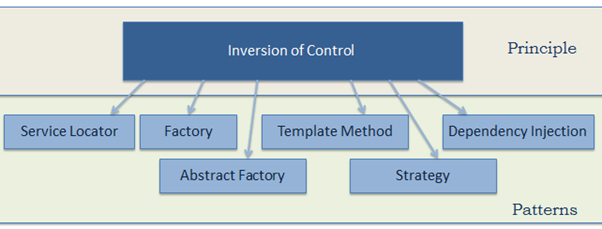

首先我们要明确的是，IoC 并不是最近才兴起的说法，更不是只有 Spring 才能应用的逻辑，而是自 OOP 面世以来就有的概念。

<!-- more -->

# 什么是 IoC？

**Inversion of Control**，译作**控制反转**，是 OOP 的一种设计原则和架构模式，还算不上是设计模式。

一句经典的解释，就是：  
**"Don't call me, I'll call you. "**

<br/>

## 问题与解决

针对“控制反转”这个概念，我们先提出三个问题：

**Q1**：什么的控制？  
**Q2**：为何反转？  
**Q3**：如何反转？

接着我们来看一下传统 Java 代码中的 HAS-A 结构：

```java
public class B {

    private A a;

    public B() {
        this.a = new A();
    }
}
```

这种耦合度较强的代码，至少有一处需要：
1. 显式或隐式地创建 A 的对象
2. B 类依赖于 A 类对象作为内部属性

对于每一次的 HAS-A，都需要这样的程序代码进行上述控制（**Q1**），当复杂度升高时，便难以掌控了（**Q2**）。  
针对 HAS-A 的这个典型问题，为了解耦这样的代码，且便于掌控代码引用，我们需要使用一个**统一的对象依赖控制器**。

IoC 能够代替程序代码包办这层控制，从而降低耦合度。  
程序代码只需向 IoC 控制器“索要”依赖的对象，而不是自己“造”。  
也就是说，**依赖对象的获得被反转了**（**Q3**），所反转的“控制”是对象间的依赖。


## 特点（**Q2**）

* 体现软件工程原则之一：解耦；
* 对实例的控制由程序转移到了控制器/容器/框架，随后便可以注入到引用中；
* 为模块化提供支撑，实现“热插拔”。


## IoC 的实现

IoC 各种概念的层次如下：


因此 IoC 仅为一种设计原则，需要具体的实现，通常还结合着 DIP（Dependency Inversion Principle）使用。

市面上较为知名的 Java IoC 容器如下：
* 轻量级：Pico Container，Avalon，**Spring**，HiveMind
* 较重量级：**JBoss**，Jdon
* 超重量级：**EJB**

它们都是基于以下三个方向去实现控制反转：
1. 构造方法注入
2. setter 注入
3. 成员变量注入

IoC 的实现有多种方式：



当然用得最多的要数依赖注入（DI）了。

<br/>

### 依赖注入 DI

**Dependency Injection**，依赖注入，属于设计模式的一种，是 IoC 的一种具体实现。

此时，被注入的对象依赖于 IoC 容器去配置依赖对象。由此便改变了以往由程序代码主动为对象的依赖赋值的操作，改为由 DI 控制器统一处理。

依赖注入的实现方式可以基于多个方面：
* 基于接口（Interface Injection）：实现特定接口，以供外部容器注入所依赖类型的对象
* 基于构造函数（Constructor Injection）：在新建对象时传入所依赖类型的对象
* 基于 setter（Setter Injection）：让外部容器调用传入所依赖类型的对象
* 基于参数（Parameter Injection）
* 基于注解
* ...

举一个简单的例子：

```java
public class TextEditor {

    private IocSpellChecker checker;


    // 不使用依赖注入
    public TextEditor() {
        this.checker = new SpellChecker();  // TextEditor 依赖于 SpellChecker
    }


    // 基于构造函数的依赖注入
    public TextEditor(IocSpellChecker checker) {  // 在构造函数注入依赖 IocSpellChecker
        this.checker = checker;
    }
}
```

如此一来，再调用 TextEditor 的时候就可以：

```java
IocSpellChecker sc = new SpellChecker();  // dependency
TextEditor textEditor = new TextEditor(sc);  // get the dependency (inject the dependency)
```

依上述，我们可以大概总结出基于 DI 的 IoC 实现：


### 依赖查找 DL

Dependency Lookup，比依赖注入更加主动
* 在需要时，通过调用框架提供的方法主动索取相对应类型的对象
* 在获取时，需要提供相关的配置文件路径、key 等信息来确定获取对象的状态

下面来看一看 Spring 框架是怎么实现 IoC 的。

<br/>

# Spring IoC

很明显，Spring IoC 将原本在程序中手动创建对象的控制权，交给了 Spring 框架来管理。


Spring 的 IoC 定义了以下概念：

**Bean**：等待被注入的依赖对象。对象不一定非得要 JavaBean，也可以是 POJO 类。

**容器**：控制反转的控制器，负责创建、管理、装配、配置 bean。  
容器管理着所有 bean 的生命周期以及它们之间的依赖链，并支持加载服务时的饿汉式初始化和懒加载。


## 好处

好处就显而易见了，都是 IoC 本身带来的红利：
* 使应用代码量降到最低，容易测试，UT 不再需要单例和 JNDI 查找机制
* 使松散耦合得以实现
* 支持即时实例化和懒加载


## Spring IoC 的容器类型

**BeanFactory**

```java
package org.springframework.beans.factory;


public interface BeanFactory {
    /*
     * 包含 bean 集合的工厂类
     * 使用上最简单，为 DI 提供基本支持
     * 相对于 ApplicationContext 更轻量级，数据量和速度可观
     * 主要应用于移动设备或基于 applet 的应用
    */

    ...
}
```

实现类：
```java
package org.springframework.beans.factory.xml;


@Deprecated
public class XmlBeanFactory extends DefaultListableBeanFactory {
    // 从 XML 文件读取配置元数据
    ...
}


// 使用：
XmlBeanFactory factory = new XmlBeanFactory(new ClassPathResource("Beans.xml"));  // 参数为配置文件全路径
HelloWorld obj = (HelloWorld) factory.getBean("helloWorld");
```


**ApplicationContext**

```java
package org.springframework.context;


public interface ApplicationContext extends EnvironmentCapable, ListableBeanFactory, HierarchicalBeanFactory, MessageSource, ApplicationEventPublisher, ResourcePatternResolver {
    /*
     * Spring 的核心，负责管理所有 bean 完整生命周期
     * BeanFactory 的子接口，在 BeanFactory 基础上提供额外功能
     *   (ListableBeanFactory extends BeanFactory)
     *
     * 在抽象类的基础上添加了更多企业特定功能，比如：
     *   - 从属性文本中解析文本
     *   - 将事件传递给所指定的监听器
     * 包含 BeanFactory 容器所有功能
     */

    ...
}
```

实现类：
```java
package org.springframework.context.support;


public class FileSystemXmlApplicationContext extends AbstractXmlApplicationContext {
    // 提供配置文件 XML 的完整路径
    ...
}

public class ClassPathXmlApplicationContext extends AbstractXmlApplicationContext {
    // 提供正确配置的 CLASSPATH 环境变量，容器便会从 CLASSPATH 搜索 bean 配置文件
    ...
}


// 使用：
ApplicationContext context = new FileSystemXmlApplicationContext("/src/Beans.xml");
HelloWorld obj = (HelloWorld) context.getBean("helloWorld");
```


```java
package org.springframework.context;


public interface WebApplicationContext extends ApplicationContext {
    // 在 Web application 范围内加载在 XML 文件中已被定义的 bean
    ...
}
```


区别：

| BeanFactory          | ApplicationContext |
| -------------------- | ------------------ |
| 使用懒加载             | 使用即时加载         |
| 使用语法显式提供资源对象 | 自己创建和管理资源对象 |
| 不支持国际化           | 支持国际化           |
| 不支持基于依赖的注解    | 支持基于依赖的注解     |


## Spring 实现概述

Spring 容器主要通过 DI，根据配置文件或注解获取 metadata，进行 Bean 依赖的管理。

Spring 的 DI 容器主要完成三个任务：

1. 根据配置文件或注解，解析出 Bean 之间完整的依赖图，拿到 Bean 的全路径名；
2. 利用 Java [反射](/2021/05/25/reflection-java)，用适当的方式创建出 Bean，保存到一个容器内；
3. 再次利用反射，在适当时机取得将被依赖的 Bean，将其作为成员变量（构造函数、setter 或其他方法）注入到依赖这个 Bean 的另一个 Bean 中。

对于通过[配置文件](/2021/12/24/spring-di)或[注解](/2022/01/01/spring-annotation)定义 Bean，随后会有专门的篇幅加以介绍。


