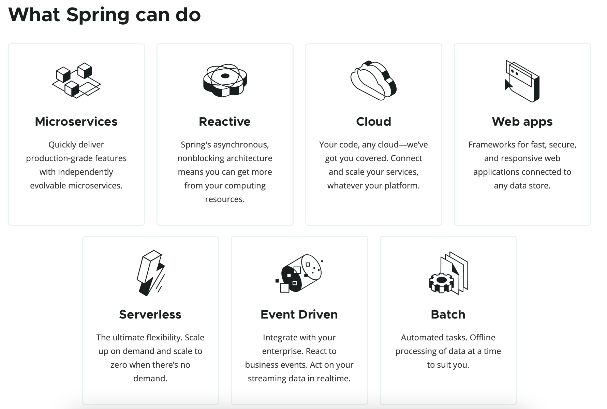

接触过 Java 开发的人，基本上都听说过 `Spring`。

<!-- more -->

Spring 是目前最受欢迎的 Java 开发容器框架。它的成功是基于 **IoC**（**I**nvension **o**f **C**ontrol, 控制反转）和 **AOP**（**A**spect **O**riented **P**rogramming, 面向切面编程）等理念，而不是技术本身。

跟 EJB 差不多的是，Spring 也是基于使用 Bean 或 JavaBean 属性（也可以是任意 POJO 组件）进行组件管理的。

Spring 的[版本迭代](https://spring.io/projects/spring-framework#learn)非常快，但是基本的架构是不会做大改动的。

Spring 能做什么？
* **微服务**（microservices）：程序员能够根据具体业务，快速搭建所需要的软件和应用架构
* **响应式编程**（reactive）
* **云**（cloud）：云端开发
* **Web 应用**（web apps）开发：覆盖了日常使用 Spring 的绝大部分场景
* **无服务**（serverless）：提供对应的操作函数到云上，按需提供服务
* **事件驱动**（event driven）：响应式的一种，通过事件对业务进行驱动形式的分发
* **批量任务处理**（batch）



<br/>

# 初衷和目标

初衷：
1. 简化 Java EE 开发
2. 为 JavaBean 提供一个更好的应用配置框架
3. 使用接口而不是使用类，是更好的编程习惯
4. 更多强调面向对象设计，而不是现行技术如 Java EE
5. 尽量减少不必要的异常捕捉
6. 使应用程序更容易测试

Spring 将使用接口的复杂度几乎降到了 0。

目标：
1. 令人更愉快使用 Spring
2. 应用程序代码并不依赖于 Spring APIs
3. Spring 不和现有的解决方案竞争，而是致力于将它们融合在一起

<br/>

# 优势
* 轻量级，基本版本的大小约为 2 MB
* 由 IoC 和 AOP 带来的高内聚，低侵入/低耦合
* 容器式的管理：包含并管理应用中对象的生命周期和配置
* 非侵入式设计：无需继承框架提供的任何类；将来更换框架的时候，之前的代码几乎可继续使用
* 声明式事务管理：只需要通过配置就可完成对事务的管理，无需手动编程
* 方便集成各种优秀框架
    * Struts, Hibernate, iBatis, Quartz, ...
* 降低 J2EE API 的使用难度，使 J2EE 开发变得更容易使用
* 支持 JUnit4 注解，方便程序的测试

<br/>

# Spring 开发项目内的各种概念

## Spring Framework

Spring Framework 是一个大引擎，是我们最常说的“Spring”，也是 Spring 所有项目的核心。

Spring Framework 包括 20+ 组件/模块，分为：
* 核心容器
    * 提供最重要的 IoC/DI 功能，包含 Core、Beans、Context 等组件
    * 创建、包含所有对象并管理应用对象的生命周期和依赖关系
* 数据处理与集成
    * 提供与数据库交互的抽象，比如对 JDBC、ORM 等的封装
    * 提供事务管理和消息驱动
* Web：提供基于 Servlet 的 Web 服务支撑
* AOP：提供面向切面编程的支持
* 测试：提供与 JUnit 等测试组件对接的支持


Spring Framework 能帮我们做什么？
* 根据配置文件，创建及组装对象之间的依赖关系；
* 通过 AOP 实现无耦合的日志记录、性能统计、安全控制等；
* 非常简单地管理数据库事务，可向下扩展到本地事务；
* 与第三方数据访问框架（Hibernate、JPA）无缝集成，自身也提供一套 JDBC 访问模版；
* 与第三方 Web 框架（Struts1/2、JSF）无缝集成，自身也提供一套 MVC 框架；
* 方便地与 J2EE 及更多技术整合（如缓存框架）。

```bash
# 核心依赖包：
spring-beans-5.0.0.RELEASE.jar  # 提供 BeanFactory
spring-context-5.0.0.RELEASE.jar  # 使用类似 JNDI 方法访问对象
spring-context-support-5.0.0.RELEASE.jar
spring-core-5.0.0.RELEASE.jar  # 框架基本组成部分，包括 IoC 和 DI
spring-expression-5.0.0.RELEASE.jar  # Spring 表达式语言支持

# AOP 模块：
spring-aop-5.0.0.RELEASE.jar  # 基于代理的 AOP 支持
spring-aspects-5.0.0.RELEASE.jar  # 基于 Aspects 的 AOP 支持

# 数据处理与集成：
spring-jdbc-5.0.0.RELEASE.jar  # 对 JDBC 连接的封装功能
spring-orm-5.0.0.RELEASE.jar  # 对象关系映射 API 集成，包括 JPA、JDO、Hibernate 等
spring-oxm-5.0.0.RELEASE.jar  # JAXB、XML Beans 等
spring-tx-5.0.0.RELEASE.jar  # 事务操作
spring-jms-5.0.0.RELEASE.jar  # 生产消费消息模型

# Web模块：
spring-web-5.0.0.RELEASE.jar  # 提供 web 基础功能
spring-webmvc-5.0.0.RELEASE.jar  # 提供 Spring MVC 功能
spring-websocket-5.0.0.RELEASE.jar  # 提供 web socket 支持
spring-webmvc-portlet-5.0.0.RELEASE.jar  # 提供 portlet 环境支持

# 测试：
spring-test  # 提供对测试功能的支持
```

依赖关系：


Spring 允许只选择适用自身开发的模块，不需要将其他模块也引入。


## Spring MVC

Spring MVC 属于 Spring Framework 的 Web 类模块中的一个提供 Web 服务的基础框架。

顾名思义，它能提供 MVC 架构和随时可用的组件，有助于分离应用程序的不同方面，如输入逻辑、业务逻辑和 UI 逻辑，且在所有元素之间提供松散耦合。


## Spring Boot

Spring Boot 是基于 Spring Framework 的解决方案套件（Suite），或者快捷方式，相当于一套脚手架。
* 集成了 Web 服务器，实现了 Spring Framework 的自动化配置，以及解决了许多常用包的依赖问题
* 开发者可很快地上手写业务代码，而不必过于关注 Spring 的部分。


## Spring Cloud

基于 Spring Boot 的分布式应用，目的是为了解决更上层的问题，且提供了一套完善的微服务框架：
* 分布式配置：多个 Spring Boot 服务使用分布式配置服务进行配置
* 服务注册/发现/路由/调用：多个 Spring Boot 服务间能很方便地互相发现和调用
* 客户端负载均衡：由 Spring Boot 服务进行负载均衡计算，来决策调用其他服务的哪个实例


# Spring v.s. EJB

比较：
* Spring 是一套具体的实现；而 EJB 3.0 是 J2EE 的规范，实现包括 JBoss 和 Oracle，两者概念是不一样的；
* 共同的核心设计理念：为松耦合的 POJO 类提供中间件服务
    * Spring 可作为中间层使用，如同 EJB 的 Session Bean
* Spring 的 DI 很强大，而 EJB 只支持 JNDI 方式的注入
* EJB 有持久层，如 JPA；Spring 可无缝结合很多持久化框架，如 Hibernate, JPA, ibatis, JDBC
* EJB 支持分布式（这是它自身最大的特点）；Spring 可通过继承 Webservice 实现，也可结合一些分布式框架实现，但相比之下 EJB 更成熟
* Spring 有 Spring MVC 提供 Web 层，而 EJB 需要结合 jsf 或自己组装 struts 等框架实现

总结：
* Spring 灵活性更强，充分利用 Java 多开源的特点；
* EJB 都是 JakartaEE 内部的东西，灵活性很差，但分布式方面表现最好。

不过软件发展到现今为止，大多数应用不需要采用分布式的解决方案，使用 EJB 的话就过为臃肿了。而且 Spring 已经基于自身开发了 Spring Cloud，扩展至分布式应用更加方便和安全。
