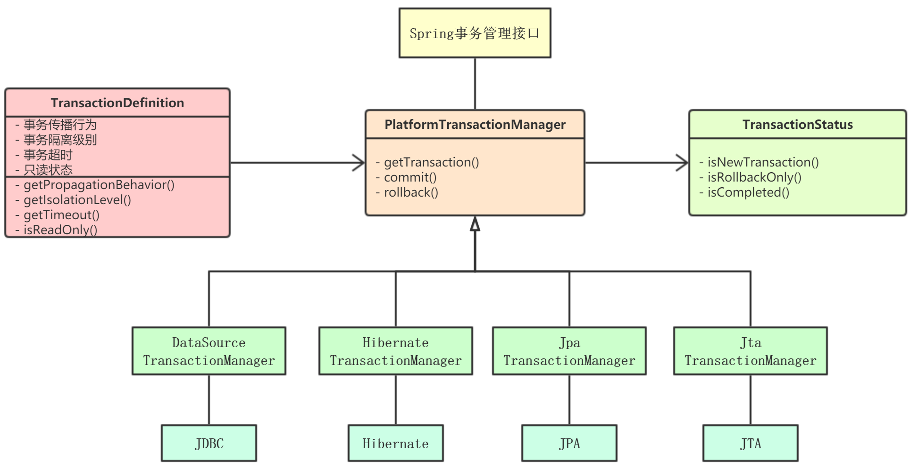
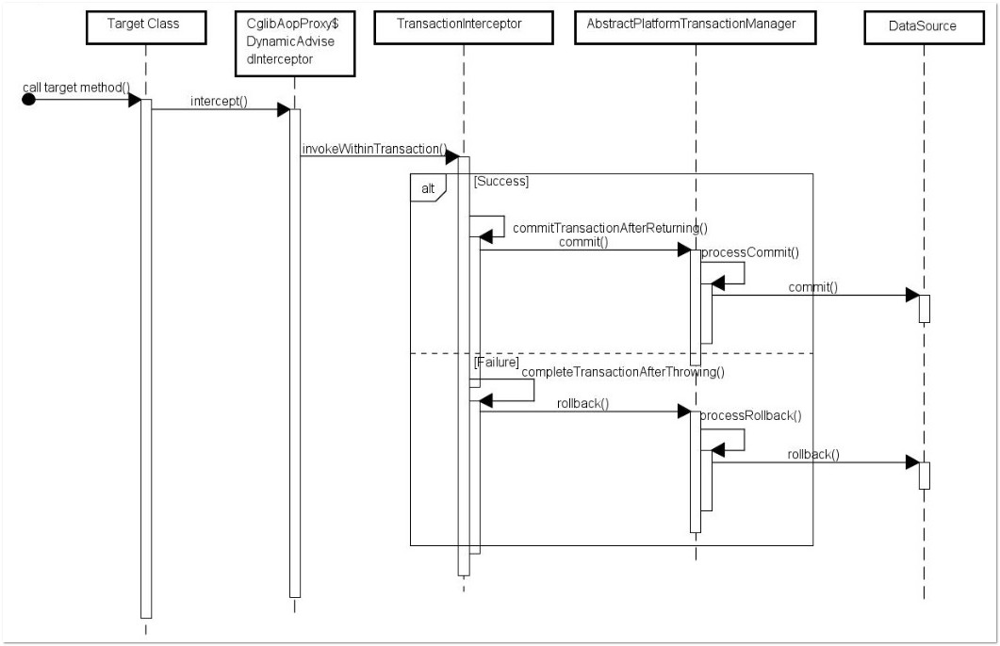

Spring 事务机制默认回滚 `RuntimeException` 及其异常子类，和 `Error` 等异常。

<!-- more -->

# 主要接口与配置

```java
package org.springframework.transaction;


public interface PlatformTransactionManager {

    // 根据指定的属性，返回当前在线（active）的事务或创建一个新的事务
    TransactionStatus getTransaction(TransactionDefinition definition) throws TransactionException; 

    // 提交指定的事务及关于它的状态
    void commit(TransactionStatus status) throws TransactionException; 

    // 回滚给定的事务
    void rollback(TransactionStatus status) throws TransactionException; 
}
```


接口方法中的形参包括 `TransactionDefinition` 和 `TransactionStatus`：

<br/>

## 事务传播级别

`TransactionDefinition`：定义事务属性，包括隔离级别和传播行为。

```java
public interface TransactionDefinition {

    /**
     * 返回传播行为，包括：
     *   TransactionDefinition.PROPAGATION_MANDATORY
     *   TransactionDefinition.PROPAGATION_NESTED
     *   TransactionDefinition.PROPAGATION_NEVER
     *   TransactionDefinition.PROPAGATION_NOT_SUPPORTED
     *   TransactionDefinition.PROPAGATION_REQUIRED（默认）
     *   TransactionDefinition.PROPAGATION_REQUIRES_NEW
     *   TransactionDefinition.PROPAGATION_SUPPORTS
     *   TransactionDefinition.TIMEOUT_DEFAULT
     */
    int getPropagationBehavior(); 

    /**
     * 返回隔离级别，即该事务独立于其他事务的工作程度，包括：
     *   TransactionDefinition.ISOLATION_DEFAULT（默认）
     *   TransactionDefinition.ISOLATION_READ_COMMITTED
     *   TransactionDefinition.ISOLATION_READ_UNCOMMITTED
     *   TransactionDefinition.ISOLATION_REPETABLE_READ
     *   TransactionDefinition.ISOLATION_SERIALIZABLE
     */
    int getIsolationLevel(); 

    String getName();  // 事务名称
    int getTimeout();  // 事务超时时间，单位为秒
    boolean isReadOnly();  // 事务是否只读
}
```

事物的传播性一般在**事务嵌套**时使用。  
比如，有一个事务 A 里面调用了另一个使用事务的方法，那么这两个事务**各自作为独立的事务**进行提交，或者将内层事务合并到外层事务中，再一并提交。

`TransactionDefinition.PROPAGATION_REQUIRED`
* Spring 默认的事务传播机制
* 支持当前事务，如果其外层不存在事务，则创建一个新的事务
* 如外层存在事务，则加入该事务，一起提交一起回滚

`TransactionDefinition.PROPAGATION_REQUIRES_NEW`
* 每次创建一个新的事务
* 如果当前事务的外层存在另一个事务，则先将外层事务挂起，等到新事务执行完毕后再恢复外层事务执行

`TransactionDefinition.PROPAGATION_SUPPORTS`
* 支持当前事务
* 如果当前事务的外层存在另一个事务，则加入该事务；如不存在，则以非事务执行

`TransactionDefinition.PROPAGATION_NOT_SUPPORTED`
* 不支持当前事务，总是执行非事务性
* 如当前外层存在事务，则将当前事务挂起，执行当前逻辑，再恢复外层事务

`TransactionDefinition.PROPAGATION_NEVER`
* 不支持当前事务，如外层事务存在则抛出异常

`TransactionDefinition.PROPAGATION_MANDATORY`
* 支持当前事务，说明该传播性方法只能在**已经存在事务**的方法中被调用
* 如不存在外层事务则抛出异常，如存在则加入该事务

`TransactionDefinition.PROPAGATION_NESTED`
* 可以保存事务至状态保存点中
* 如存在当前事务，则在一个嵌套的事务中执行，如没有事务则创建一个
* 当事务回滚时，会回滚到某一个保存点上，从而避免所有嵌套事务都回滚

`TransactionDefinition.TIMEOUT_DEFAULT`
* 使用默认的底层事务系统，如果不支持超时，则以非事务执行


## 事务状态

`TransactionStatus`：负责事务开始到结束期间的状态。

```java
public interface TransactionStatus extends SavepointManager { 

    // 当前事务是否为新事务
    boolean isNewTransaction();

    // 是否有一个保存点
    boolean hasSavepoint();

    // 设置事务为 rollback-only 标记
    void setRollbackOnly();

    // 该事务是否被标记为 rollback-only
    boolean isRollbackOnly();

    // 事务是否完成（被提交或回滚）
    boolean isCompleted();
}
```




# Spring 事务管理

Spring 支持**编程式**和**声明式**两种事务管理方式。


## 编程式事务管理

通过编程实现的事务管理，胜在操作灵活，但是维护困难，而且属于侵入式编程，与 Spring Framework 耦合程度高。

举个例子，我们有下面一个 POJO 类：

```java
public class StudentMarks {

    private String name;
    private Integer age;
    private Integer id;
    private Integer marks; 
    private Integer year; 
    private Integer sid; 

    ... // getters and setters 
}
```

对应地，在 DAO 实现类中引入事务管理：

```java
...

private JdbcTemplate jdbcTemplateObject; 
private PlatformTransactionManager transactionManager;  // 侵入式编程

...

@Override
public void create(String name, Integer age, Integer marks, Integer year) throws Exception { 

    TransactionDefinition def = new DefaultTransactionDefinition();
    TransactionStatus status = transactionManager.getTransaction(def);
    try {
        // add row
        String SQL1 = "insert into Student(name, age) values(?, ?)";
        jdbcTemplateObject.update(SQL1, name, age);

        // Get the latest student id to be used in Marks table 
        String SQL2 = "select max(id) from Student"; 
        int sid = jdbcTemplateObject.queryForInt(SQL2);

        String SQL3 = "insert into Marks(sid, marks, year) values(?, ?, ?)";
        jdbcTemplateObject.update(SQL3, sid, marks, year); 
        System.out.println("Created Name = " + name + ", Age = " + age);

        // commit 3 data operations in one transaction
        transactionManager.commit(status); 
    } catch (DataAccessException e) { 
        System.out.println("Error in creating record, rolling back."); 
        transactionManager.rollback(status); 
        throw e; 
    }
}

...
```

配置文件：

```xml
<!-- encoding... -->
<beans ...>

    <!-- MANDATORY: Initialization for data source -->
    <bean id="dataSource" class="org.springframework.jdbc.datasource.DriverManagerDataSource">
        <property name="driverClassName" value="com.mysql.jdbc.Driver"/>
        <property name="url" value="jdbc:mysql://localhost:3306/TEST"/>
        <property name="username" value="root"/>
        <property name="password" value="password"/>
    </bean>

    <!-- MANDATORY: Initialization for TransactionManager --> 
    <bean id="transactionManager" class="org.springframework.jdbc.datasource.DataSourceTransactionManager"> 
        <property name="dataSource" ref="dataSource" /> 
    </bean>

    <!-- Definition for studentJDBCTemplate bean -->
    <bean id="studentJDBCTemplate" class="com.xxx.StudentJDBCTemplate">
        <property name="dataSource" ref="dataSource" />
    </bean>

</beans>
```

除了 PlatformTransactionManager，还可以使用 TransactionTemplate 进行编程式事务管理。

虽然说编程式事务管理为侵入式编程，对代码维护会有所挑战，但是对于事务应用较少的业务代码，编程式事务处理不失为一个好选择。

<br/>

## 声明式事务管理

声明式事务管理使用**注释**或 **XML 配置**管理事务，将事务管理的逻辑从业务代码中分离开来，不需要在 JdbcTemplate 等模版类中显式调用 transaction manager 来提交或回滚事务。

声明式事务管理无侵入，业务影响小，是最好的选择。


### 基于注释 `@Transactional`

通过 @Transactional 注解开启一个事务。

实现机制：基于 [AOP](/2022/03/18/spring-aop)
1. 代码运行时先生成一个代理对象
2. 代理对象根据 @Transactional 配置的属性，决定声明了 @Transactional 的目标方法是否由拦截器 TransactionInterceptor 来拦截
3. 在 TransactionInterceptor 拦截时，会在目标方法开始执行之前创建并加入事务
4. 执行目标方法的逻辑
5. 根据执行情况作后续处理：
    1. 执行情况无异常：AbstractPlatformTransactionManager 操作数据源提交事务
    2. 执行情况异常：AbstractPlatformTransactionManager 操作数据源回滚事务

程序执行时序图如下：



例子：

```java
@Transactional  // 所有该类的 public 方法都会被配置相同的事务属性
public class TestServiceBean implements TestService {

    private TestDao dao;

    public void setDao(TestDao dao) {
        this.dao = dao;
    }

    @Transactional(propagation=Propagation.NOT_SUPPORTED)
    public List getAll() {
        return null;
    }
    // 注：方法级别的注解会覆盖类级别的注解
}
```

@Transactional 可配置的**属性**信息与接口 TransactionDefinition 的方法一一对应：

| 属性名 | 描述  |
| ----- | ---- |
| name        | 指定所使用的事务管理器，适用于配置文件中存在多个 TransactionManager 的情况 |
| propagation | 设置事务的传播行为，取值同接口 TransactionDefinition 的枚举值 |
| isolation   | 设置底层数据库的事务隔离级别<br/>通常使用数据库默认的隔离级别即可 |
| timeout     | 如超过该时间但事务尚未完成：自动回滚事务<br/>默认值为 -1：表示永不超时 |
| readOnly    | 设置当前事务是否为只读事务，默认为 `false`<br/>`@Transactional(readOnly="true")` |
| rollbackFor | 指定能够触发事务回滚的异常类型，值为 Class 对象数组<br/>如指定多个异常类型：各类型之间通过逗号分隔 |
| rollbackForClassName | 指定能够触发事务回滚的异常类名数组 |
| noRollbackFor | 抛出其指定的异常类型，不回滚事务 |
| noRollbackForClassName | 抛出指定的类名数组中的某一个，不回滚事务 |

配置文件：

```xml
<!-- encoding... -->
<beans ...
    xmlns:tx="http://www.springframework.org/schema/tx">

    <tx:annotation-driven />  <!-- 开启事务 -->

    <!-- MANDATORY: Initialization for data source -->
    <bean id="dataSource" class="org.springframework.jdbc.datasource.DriverManagerDataSource">
        <property name="driverClassName" value="com.mysql.jdbc.Driver"/>
        <property name="url" value="jdbc:mysql://localhost:3306/TEST"/>
        <property name="username" value="root"/>
        <property name="password" value="password"/>
    </bean>

    <!-- MANDATORY: Initialization for TransactionManager -->
    <bean id="transactionManager" class="org.springframework.jdbc.datasource.DataSourceTransactionManager">
        <property name="dataSource" ref="dataSource" />
    </bean>

</beans>
```

配置指定回滚的异常：

```java
@Transactional(rollbackFor = JavastackException.class)
@Transactional(rollbackFor = [aException.class, bException.class])
```

配置指定不回滚的异常：

```java
@Transactional(noRollbackFor = JavastackException.class)
@Transactional(noRollbackFor = [aException.class, bException.class])
```

需要注意的地方：

**1**. @Transactional **只能应用到 `public` 方法**才有效。

因为 TransactionInterceptor 在进行拦截之前会调用 `AbstractFallbackTransactionAttributeSource#computeTransactionAttribute()`：

```java
protected TransactionAttribute computeTransactionAttribute(Method method, Class<?> targetClass) {
    // Don't allow no-public methods as required.
    if (allowPublicMethodsOnly() && !Modifier.isPublic(method.getModifiers())) {
        return null;
    }  // 非 public 不会去获取 @Transactional 属性配置信息
}
```

另外，CglibAopProxy 内部的 `DynamicAdvisedInterceptor#intercept()` 或 `JdkDynamicAopProxy#invoke()` 也会间接调用以上方法。 

所以编程的时候，默认权限或私有代码就不要标记 @Transactional 了。

**2**. 避免 AOP 自调用问题

如果一个类中的一个或多个非事务方法中**调用自身类的事务方法**，那么在调用非事务方法时，事务方法的事务会**被忽略**。

```java
@Service
public class OrderService {

    private void insert() {
        insertOrder();  // no transaction
    }

    @Transactional
    public void insertOrder() {
        // insert log info
        // insertOrder
        // updateAccount
    }
}
```

如上，在执行 insert() 时，insertOrder() 的事务不会被执行；如果抛出了异常，事务也不会被回滚。

因为：Spring 扫描到所有添加了 @Transactional 注解的类之后将它们初始化，对应地会各自生成一个**代理对象**，Spring 事务再去判断代理对象的执行方法是否添加了 @Transactional 注解。

而对象中的非事务方法去调用事务方法属于**自调用**，自调用方法并不是由代理通过反射执行的，因此被调用的事务方法，其注解无效。


### @Transactional 源码简析

上面一小节的时序图已经说明了大概情况。

Spring Framework 在为某一操作建立事务之前，先寻找**增强器**，判断这些增强器是否与方法或类相匹配，以完成对应类或方法的事务属性解析。

步骤如下：

首先：初始化

```java
package org.springframework.transaction.config;

public class TxNamespaceHandler extends NamespaceHandlerSupport {

    ...

    @Override
    public void init() {

        // 使用对应的解析器去解析 advice, annotation-driven, transaction-manager 等标签
        registerBeanDefinitionParser("advice", new TxAdviceBeanDefinitionParser());
        registerBeanDefinitionParser("annotation-driven", new AnnotationDrivenBeanDefinitionParser());
        registerBeanDefinitionParser("jta-transaction-manager", new JtaTransactionManagerBeanDefinitionParser());
        ...
    }

    ...
}
```

读到配置中的注解之后，调用 `AnnotationDrivenBeanDefinitionParser` 解析器的 parse() 方法：

```java
public BeanDefinition parse(Element element, ParserContext parserContext) {
    registerTransactionalEventListenerFactory(parserContext);
    String mode = element.getAttribute("mode");
    // AspectJ 另外处理
    if ("aspectj".equals(mode)) {
        // mode="aspectj"
        registerTransactionAspect(element, parserContext);
        ...

        if (ClassUtils.isPresent("javax.transaction.Transactional", getClass().getClassLoader())) {
            registerJtaTransactionAspect(element, parserContext);
        }
    }
    else {
        // mode="proxy"
        AopAutoProxyConfigurer.configureAutoProxyCreator(element, parserContext);
        // 默认以 aop 为基础
    }
    return null;
}
```

于是：

```java
// AopAutoProxyConfigurer

public static void configureAutoProxyCreator(Element element, ParserContext parserContext) {
    /**
     * 注册 beanName 为 org.springframework.aop.config.internalAutoProxyCreator 的 bean：
     * InfrastructureAdvisorAutoProxyCreator，自动创建代理器
     *     实现了 InstantiationAwareBeanPostProcessor 接口
     *     即：Spring 容器实例化所有 bean 时会保证调用 postProcessAfterInitialization 方法
     */
    AopNamespaceUtils.registerAutoProxyCreatorIfNecessary(parserContext, element);

    // txAdvisorBeanName = org.springframework.transaction.config.internalTransactionAdvisor
    String txAdvisorBeanName = TransactionManagementConfigUtils.TRANSACTION_ADVISOR_BEAN_NAME;
    if (!parserContext.getRegistry().containsBeanDefinition(txAdvisorBeanName)) {
        Object eleSource = parserContext.extractSource(element);

        // Create the TransactionAttributeSource definition. 
        // 创建 TransactionAttributeSource 的 bean
        RootBeanDefinition sourceDef = new RootBeanDefinition("org.springframework.transaction.annotation.AnnotationTransactionAttributeSource");
        // 注册 bean，并使用 Spring 中的定义规则生成 beanName
        String sourceName = parserContext.getReaderContext().registerWithGeneratedName(sourceDef);

        // 创建 TransactionInterceptor 的 bean
        RootBeanDefinition interceptorDef = new RootBeanDefinition(TransactionInterceptor.class);
        interceptorDef.getPropertyValues().add("transactionAttributeSource", new RuntimeBeanReference(sourceName));
        String interceptorName = parserContext.getReaderContext().registerWithGeneratedName(interceptorDef);

        // 创建 TransactionAttributeSourceAdvisor 的 bean
        RootBeanDefinition advisorDef = new RootBeanDefinition(BeanFactoryTransactionAttributeSourceAdvisor.class);
        // 组成切面：
        // 1. 将 sourceName 的 bean 注入 advisor 的 transactionAttributeSource 属性中
        advisorDef.getPropertyValues().add("transactionAttributeSource", new RuntimeBeanReference(sourceName));
        // 2. 将 interceptorName 的 bean 注入到 advisor 的 adviceBeanName 属性中
        advisorDef.getPropertyValues().add("adviceBeanName", interceptorName);
        if (element.hasAttribute("order")) {
            // 如果配置了 order 属性，则加入到 bean 中
            advisorDef.getPropertyValues().add("order", element.getAttribute("order"));
        }
        // 以 txAdvisorBeanName 名字注册 advisorDef
        parserContext.getRegistry().registerBeanDefinition(txAdvisorBeanName, advisorDef);

        // 创建 CompositeComponentDefinition
        CompositeComponentDefinition compositeDef = new CompositeComponentDefinition(element.getTagName(), eleSource);
        compositeDef.addNestedComponent(new BeanComponentDefinition(sourceDef, sourceName));
        compositeDef.addNestedComponent(new BeanComponentDefinition(interceptorDef, interceptorName));
        compositeDef.addNestedComponent(new BeanComponentDefinition(advisorDef, txAdvisorBeanName));
        parserContext.registerComponent(compositeDef);
    }
}
```

根据上述源码可知，在创建增强器的时候，注册了三个类：
1. `AnnotationTransactionAttributeSource`：封装了目标方法是否被拦截的逻辑
    1. 没有实现 Pointcut 接口
    2. 在后面目标方法判断时，委托 AnnotationTransactionAttributeSource.getTransactionAttributeSource()，通过适配器模式返回 Pointcut 切点信息
2. `TransactionInterceptor`：实现 Advice 接口，定义了拦截后执行的增强
3. `TransactionAttributeSourceAdvisor`：实现 Advisor 接口，包装上面两个信息（增强+切入点），即形成切面
    1. 切面（增强器）属于 BeanFactoryTransactionAttributeSourceAdvisor
    2. 组成环绕型（`@Around`）的增强

实例化 bean 时，调用代理器父类 `AbstractAutoProxyCreator#postProcessAfterInitialization()`：

```java
public Object postProcessAfterInitialization(@Nullable Object bean, String beanName) {
    if (bean != null) {
        // 组装 key
        Object cacheKey = getCacheKey(bean.getClass(), beanName);
        if (this.earlyProxyReferences.remove(cacheKey) != bean) {
            // 如果适合被代理，则需要封装指定的 bean
            return wrapIfNecessary(bean, beanName, cacheKey);
            /**
             * 这个方法干了什么：
             *   - 找出指定 bean 对应的增强器
             *   - 根据找出的增强器创建代理
             */
        }
    }
    return bean;
}
```

创建代理的时候，还需：

**1**. 判断目标方法是否适合

```java
public static boolean canApply(Advisor advisor, Class<?> targetClass, boolean hasIntroductions) {
    if (advisor instanceof IntroductionAdvisor) {
        return ((IntroductionAdvisor) advisor).getClassFilter().matches(targetClass);
    }
    else if (advisor instanceof PointcutAdvisor) {
        // TransactionAttributeSourceAdvisor 父类是 PointcutAdvisor，因此能取出切点信息
        PointcutAdvisor pca = (PointcutAdvisor) advisor;
        return canApply(pca.getPointcut(), targetClass, hasIntroductions);
    }
    else {
        // It doesn't have a pointcut so we assume it applies.
        return true;
    }
}
```

根据之前注入的切面类型 AnnotationTransactionAttributeSource，再通过以下方法包装：

```java
private final TransactionAttributeSourcePointcut pointcut = new TransactionAttributeSourcePointcut() {

    @Override
    @Nullable
    protected TransactionAttributeSource getTransactionAttributeSource() {
        // 实现父类的方法，在子类中进行了扩展，返回之前在标签注册时的 AnnotationTransactionAttributeSource
        return transactionAttributeSource;
    }
};
```

**2**. 匹配标签：识别 @Transactional 标签

```java
// TransactionAttributeSourcePointcut
@Override
public boolean matches(Method method, Class<?> targetClass) {
    // 事务切点匹配的方法，判定是否是事务方法
    TransactionAttributeSource tas = getTransactionAttributeSource();
    return (tas == null || tas.getTransactionAttribute(method, targetClass) != null);
}

// 一直跟踪到 AnnotationTransactionAttributeSource.determineTransactionAttribute
protected TransactionAttribute determineTransactionAttribute(AnnotatedElement element) {
    // 遍历注册的注解解析器进行解析
    for (TransactionAnnotationParser parser : this.annotationParsers) {
        TransactionAttribute attr = parser.parseTransactionAnnotation(element);
        if (attr != null) {
            return attr;
        }
    }
    return null;
}

// 此刻直接定位到事务注解的解析器
// SpringTransactionAnnotationParser
public TransactionAttribute parseTransactionAnnotation(AnnotatedElement element) {
    // 解析事务注解的属性
    AnnotationAttributes attributes = AnnotatedElementUtils.findMergedAnnotationAttributes(
            element, Transactional.class, false, false);
    if (attributes != null) {  // 判断是否含有 @Transactional 注解
        return parseTransactionAnnotation(attributes);  // 开始解析事务注解的每一个属性
    }
    else {
        return null;
    }
}

// 解析事务注解的属性
protected TransactionAttribute parseTransactionAnnotation(AnnotationAttributes attributes) {
    RuleBasedTransactionAttribute rbta = new RuleBasedTransactionAttribute();
    // 解析事务注解的每一个属性
    Propagation propagation = attributes.getEnum("propagation");
    rbta.setPropagationBehavior(propagation.value());

    Isolation isolation = attributes.getEnum("isolation");
    rbta.setIsolationLevel(isolation.value());

    rbta.setTimeout(attributes.getNumber("timeout").intValue());
    rbta.setReadOnly(attributes.getBoolean("readOnly"));
    rbta.setQualifier(attributes.getString("value"));

    List<RollbackRuleAttribute> rollbackRules = new ArrayList<>();
    for (Class<?> rbRule : attributes.getClassArray("rollbackFor")) {
        rollbackRules.add(new RollbackRuleAttribute(rbRule));
    }
    for (String rbRule : attributes.getStringArray("rollbackForClassName")) {
        rollbackRules.add(new RollbackRuleAttribute(rbRule));
    }
    for (Class<?> rbRule : attributes.getClassArray("noRollbackFor")) {
        rollbackRules.add(new NoRollbackRuleAttribute(rbRule));
    }
    for (String rbRule : attributes.getStringArray("noRollbackForClassName")) {
        rollbackRules.add(new NoRollbackRuleAttribute(rbRule));
    }
    rbta.setRollbackRules(rollbackRules);

    return rbta;
}
```

之后就在运行时执行事务，主要有几个处理步骤：
1. 获取事务属性
2. 加载配置中的 transactionManager
3. 不同事物处理方式使用不同逻辑
4. 在目标方法执行前获取事务并收集事务信息
5. 执行目标方法
6. 出现异常，尝试异常处理
7. 提交事务前的事务信息消除
8. 提交事务


**1**. 执行注册到 BeanFactoryTransactionAttributeSourceAdvisor 中的 TransactionInterceptor 进行增强

```java
// 事务增强器 TransactionInterceptor    
// 继承于 MethodInterceptor（org.aopallience.intercept.MethodInterceptor）
public Object invoke(MethodInvocation invocation) throws Throwable {
    // 执行事务拦截器，完成整个事务的逻辑
    Class<?> targetClass = (invocation.getThis() != null ? AopUtils.getTargetClass(invocation.getThis()) : null);
    // Adapt to TransactionAspectSupport's invokeWithinTransaction...
    return invokeWithinTransaction(invocation.getMethod(), targetClass, invocation::proceed);
}

// 调用父类 TransactionAspectSupport.invokeWithinTransaction()
protected Object invokeWithinTransaction(Method method, @Nullable Class<?> targetClass, final InvocationCallback invocation) throws Throwable {

    // If the transaction attribute is null, the method is non-transactional.
    // 查询目标方法事务属性、确定事务管理器、构造连接点标识（用于确认事务名称）
    TransactionAttributeSource tas = getTransactionAttributeSource();
    // 1. 获取对应事务属性
    final TransactionAttribute txAttr = (tas != null ? tas.getTransactionAttribute(method, targetClass) : null);
    // 2. 获取事务管理器
    final PlatformTransactionManager tm = determineTransactionManager(txAttr); // 确定事务管理器
    // 构造方法唯一标识（类.方法）
    final String joinpointIdentification = methodIdentification(method, targetClass, txAttr);

    // 3. 使用不同的逻辑
    if (txAttr == null || !(tm instanceof CallbackPreferringPlatformTransactionManager)) {
        // 不带回调的事务处理，一般是声明式事务处理
        // 标准事务划分 : 使用 getTransaction 和 commit / rollback 调用
        TransactionInfo txInfo = createTransactionIfNecessary(tm, txAttr, joinpointIdentification); // 4. 开启事务
        Object retVal;
        try {
            // 5. 传入的是回调函数对象：invocation.proceed。 执行被增强的方法
            retVal = invocation.proceedWithInvocation();
        }
        catch (Throwable ex) {
            // 6. 异常回滚
            completeTransactionAfterThrowing(txInfo, ex);
            throw ex;
        }
        finally {
            // 7. 清除信息
            cleanupTransactionInfo(txInfo);
        }
        // 8. 提交事务
        commitTransactionAfterReturning(txInfo);
        return retVal;
    }
    else {
        // 带回调的事务执行处理，一般用于编程式事务处理
        final ThrowableHolder throwableHolder = new ThrowableHolder();
        // It's a CallbackPreferringPlatformTransactionManager: pass a TransactionCallback in.
        try {
            Object result = ((CallbackPreferringPlatformTransactionManager) tm).execute(txAttr, status -> {
                TransactionInfo txInfo = prepareTransactionInfo(tm, txAttr, joinpointIdentification, status);
            ...
            return result;
        }
    }
}

// 确定事务管理器
// 在配置文件中配置好了之后，返回应该是 DataSourceTransactionManager
protected PlatformTransactionManager determineTransactionManager(@Nullable TransactionAttribute txAttr) {
    // Do not attempt to lookup tx manager if no tx attributes are set
    // 寻找事务管理器
    if (txAttr == null || this.beanFactory == null) {
        // 如没有事务属性或者 BeanFactory 为空：从缓存里面寻找
        return asPlatformTransactionManager(getTransactionManager());
    }

    String qualifier = txAttr.getQualifier();
    // 如果注解配置中指定了事务管理器，直接取出使用
    if (StringUtils.hasText(qualifier)) {
        return determineQualifiedTransactionManager(this.beanFactory, qualifier);
    }
    else if (StringUtils.hasText(this.transactionManagerBeanName)) {
        return determineQualifiedTransactionManager(this.beanFactory, this.transactionManagerBeanName);
    }
    else {
        // 上面步骤都没找到，最后才去容器中根据 className 来寻找
        PlatformTransactionManager defaultTransactionManager = asPlatformTransactionManager(getTransactionManager());
        ...
        return defaultTransactionManager;
    }
}

// 开启事务
protected TransactionInfo createTransactionIfNecessary(PlatformTransactionManager tm, TransactionAttribute txAttr, final String joinpointIdentification) {
    // 如果没有名称指定则使用方法唯一标识，并使用 DelegatingTransactionAttribute 包装 txAttr
    if (txAttr != null && txAttr.getName() == null) {
        txAttr = new DelegatingTransactionAttribute(txAttr) {
            @Override
            public String getName() {
                return joinpointIdentification;
            }
        };
    }

    TransactionStatus status = null;
    if (txAttr != null) {
        if (tm != null) {
            // 获取 TransactionStatus （获得数据库连接）
            status = tm.getTransaction(txAttr);
        }
    }
    // 根据指定的属性与 status 准备一个 TransactionInfo
    return prepareTransactionInfo(tm, txAttr, joinpointIdentification, status);
}
```

**2**. 获取事务

```java
public abstract class AbstractPlatformTransactionManager implements PlatformTransactionManager, Serializable {
    @Override
    public final TransactionStatus getTransaction(@Nullable TransactionDefinition definition) throws TransactionException {
        Object transaction = doGetTransaction();
        doBegin(transaction, definition);
        prepareSynchronization(status, definition);
        return status;
    }
}

// 对于 status = tm.getTransaction(txAttr)，具体调用 DataSourceTransactionManager 类中的方法
protected Object doGetTransaction() {
    DataSourceTransactionObject txObject = new DataSourceTransactionObject();
    txObject.setSavepointAllowed(isNestedTransactionAllowed());
    // 如果当前线程已经记录数据库链接则使用原有链接
    ConnectionHolder conHolder = (ConnectionHolder) TransactionSynchronizationManager.getResource(obtainDataSource());

    txObject.setConnectionHolder(conHolder, false); // false 表示非新创建连接
    return txObject;
}

// 在同一线程中判断是否有重复的事务：TransactionSynchronizationManager.getResource()
// resource 中以 dataSource 为 key 保存当前线程池与当前线程中的一个连接，以后这个线程获取连接时都会获取同一个连接
private static final ThreadLocal<Map<Object, Object>> resources = new NamedThreadLocal<>("Transactional resources");

private static Object doGetResource(Object actualKey) {
    Map<Object, Object> map = resources.get();
    if (map == null) {
        return null;
    }

    // 判断依据：当前线程、当前数据源(DataSource)中是否存在活跃的事务
    Object value = map.get(actualKey);
    // Transparently remove ResourceHolder that was marked as void...
    if (value instanceof ResourceHolder && ((ResourceHolder) value).isVoid()) {
        map.remove(actualKey);
        // Remove entire ThreadLocal if empty...
        if (map.isEmpty()) {
            resources.remove();
        }
        value = null;
    }
    return value;
}
```

判断当前线程是否存在事务：
* 当前线程记录的连接（ConnectionHolder）不为空
* 连接中的属性 transactionActive 不为空

**3**. 事务创建

```java
// DataSourceTransactionManager
protected void doBegin(Object transaction, TransactionDefinition definition) {
    DataSourceTransactionObject txObject = (DataSourceTransactionObject) transaction;
    Connection con = null;
    // 没有数据库连接或数据库连接不同步：再造一个
    if (!txObject.hasConnectionHolder() || txObject.getConnectionHolder().isSynchronizedWithTransaction()) {
        Connection newCon = obtainDataSource().getConnection();
        txObject.setConnectionHolder(new ConnectionHolder(newCon), true);
    }
    txObject.getConnectionHolder().setSynchronizedWithTransaction(true);
    con = txObject.getConnectionHolder().getConnection();

    // 设置隔离级别
    Integer previousIsolationLevel = DataSourceUtils.prepareConnectionForTransaction(con, definition);
    txObject.setPreviousIsolationLevel(previousIsolationLevel);

    // configured the connection pool to set it already.
    // 更改自动提交设置，由 spring 进行控制
    if (con.getAutoCommit()) {
        txObject.setMustRestoreAutoCommit(true);
        con.setAutoCommit(false);
    }

    // 准备事务连接
    prepareTransactionalConnection(con, definition);
    // 设置判断当前线程是否存在事务的依据
    txObject.getConnectionHolder().setTransactionActive(true);

    // 设置超时时间
    int timeout = determineTimeout(definition);
    if (timeout != TransactionDefinition.TIMEOUT_DEFAULT) {
        txObject.getConnectionHolder().setTimeoutInSeconds(timeout);
    }

    // Bind the connection holder to the thread.
    if (txObject.isNewConnectionHolder()) {
        // 将当前获取到的连接绑定到当前线程
        TransactionSynchronizationManager.bindResource(obtainDataSource(), txObject.getConnectionHolder());
    }
}
// 即：Spring 事务的开启就是将数据库自动提交属性设置为 false
```


### 基于 XML 配置文件：添加 transaction 配置

```xml
<!-- encoding... -->
<beans ...
    xmlns:tx="http://www.springframework.org/schema/tx">

    <!-- MANDATORY: Initialization for data source -->
    <bean id="dataSource" class="org.springframework.jdbc.datasource.DriverManagerDataSource">
        <property name="driverClassName" value="com.mysql.jdbc.Driver"/>
        <property name="url" value="jdbc:mysql://localhost:3306/TEST"/>
        <property name="username" value="root"/>
        <property name="password" value="password"/>
    </bean>

    <!-- NEW 添加基于 AOP 的事务管理的 aop:config -->
    <tx:advice id="txAdvice" transaction-manager="transactionManager"> 
        <tx:attributes> 
            <tx:method name="create"/>  <!-- 需要添加事务管理的方法切入点 -->
        </tx:attributes> 
    </tx:advice> 

    <aop:config> 
        <aop:pointcut id="createOperation" expression="execution(* com.xxx.StudentJDBCTemplate.create(..))"/> 
        <aop:advisor advice-ref="txAdvice" pointcut-ref="createOperation"/> 
    </aop:config>

    <!-- MANDATORY: Initialization for TransactionManager -->
    <bean id="transactionManager" class="org.springframework.jdbc.datasource.DataSourceTransactionManager">
        <property name="dataSource" ref="dataSource" />
    </bean>

    <!-- Definition for studentJDBCTemplate bean -->
    <bean id="studentJDBCTemplate" class="com.xxx.StudentJDBCTemplate">
        <property name="dataSource" ref="dataSource" />
    </bean>

</beans>
```
