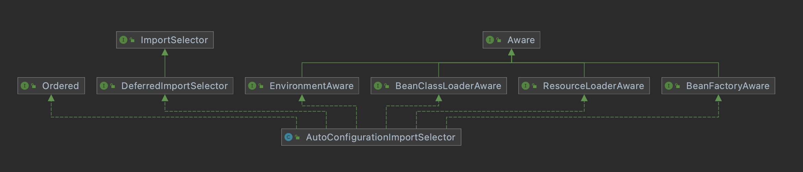

Spring Boot 是为了简化 Spring 应用搭建及开发流程而推出的一个“脚手架”，相当于对 Spring 进行了一层封装。

<!-- more -->

它使用特定的方式进行配置（“**约定大于配置**”），让开发人员不需要自己再去定义样板化的配置，更加专注于业务的开发，或者说，更加“傻瓜”地使用 Spring 进行开发。


# 核心：自动配置

Spring Boot 的核心最直接体现在 Spring Boot 的 starter 依赖上。

starter 在 spring 的官方解释是：a set of convenient dependency descriptors。它们**封装了项目构建所需要的一整套依赖**，由此便减少了很多构建所需要的配置。  
为了方便，官方 starter 的命名都以 spring-boot-starter-* 为格式，* 代表某个具体的应用。  
比如 `spring-boot-starter-web` 是给 web 应用开发做的依赖包，包括 `spring-boot-starter-tomcat` `spring-web` 等；`spring-boot-starter-amqp` 是给消息队列开发做的依赖包。  
在依赖中引入的每一个 starter，相当于一个应用启动“场景”。官方提供了不少的 starter，当然自己也可以定义 starter。

最底层（Core）的 starter 是 `spring-boot-starter`，包含了对自动配置（`spring-boot-autoconfigure`）的支持、日志（`spring-boot-starter-logging`）和 YAML 依赖。


## 都配置了啥？

Spring Boot 默认配置了很多框架的使用方式，简化了项目管理工具（Maven, Gradle）配置；

Spring Boot 自动配置了很多**常用第三方库**的版本，只要声明了依赖，并且存在相应的 jar（Spring 和第三方库），Spring 就会根据自动配置把所需的依赖都拉进来，由此能解决了很多第三方库因为不同版本所导致的相互无法兼容的问题（包括 Spring Framework 和 Spring Boot 的版本适配问题）。  
如默认的配置不能满足需求，可替换掉自动配置类，使用自己的配置：比如用不上默认的 MySQL 版本（如 8.0.25），可通过手动引入其他版本的依赖来覆盖。  
Spring Boot **优先检测自定义设置**，如没有就使用官方提供的默认值。

除自动配置外，Spring Boot 还有以下特点：
1. 能创建独立（stand-alone）的 Spring 应用程序；
2. 内嵌 Tomcat、Jetty、Undertow 等，无需再部署 WAR 文件：再也不需要额外部署一个 tomcat 了；
3. 提供常用的安全性、性能维度度量、运行状况检查、外部化配置等生产环境所需验证体系；
4. 无需 XML 手工配置（`<bean>` 等）。


# 版本迭代

目前主要在用 Spring Boot 2.5+，Spring Boot 1 和 Spring Boot 2 之间的区别还是比较大的。

要注意的是，并不是每一个版本的 Spring 都能与随便一个版本的 Spring Boot 相结合，必须**结合 Spring Boot 的 System Requirements** 来安装。  
比如 Spring Boot 2.5.1 就需要 5.3.8 版本以上的 Spring。  
同时，Spring Boot 对 **Maven**（**3.5+**）和 **Gradle**（**6.8.x, 6.9.x, 7.x**）的版本都有要求。

Spring Boot 更新迭代速度非常快，一定程度上会带来一些问题：比如 `Bootstrapper` 在 Spring 2.4.5 已弃用，改为使用 `BootstrapRegistryInitializer` 做兼容。

虽说迭代快，但是基本的那一套不会做太大的改动。

Spring Boot 2.x 底层架构主要分两部分：
1. Servlet Stack：搭建 **Spring MVC** 的基础，使用阻塞 I/O 架构实现请求模型，基于 Spring MVC、Spring Security、JDBC/JPA 等部分提供 Servlet 容器和 API；
2. Reactive Stack：**Spring WebFlux**，是非阻塞 Web 框架的基础，处理高并发网络连接，基于 Spring Security Reactive、Webflux、Mongo、Redis 等部分的封装提供 Netty 等容器和响应式流适配器。


开发者可任意选择其中一种作为应用的框架进行开发。


# Spring Boot 项目结构

一个 Spring Boot 项目创建完毕后，会自动生成以下文件：


## 应用启动类

启动类一般跟项目名同名（Artifact + `Application`），带 `main()` 方法（Java 应用入口），是整个 Spring 应用的入口。

例如：

```java
@SpringBootApplication
public class CarFactoryApplication {

    public static void main(String[] args) {
        SpringApplication.run(CarFactoryApplication.class, args);
    }

}
```

其中 `@SpringBootApplication` 就是 Spring 应用的**启动注解**。详情如下：

```java
package org.springframework.boot.autoconfigure;

...  // imports

@Target(ElementType.TYPE)
@Retention(RetentionPolicy.RUNTIME)
@Documented
@Inherited
@SpringBootConfiguration
@EnableAutoConfiguration
@ComponentScan(excludeFilters = { @Filter(type = FilterType.CUSTOM, classes = TypeExcludeFilter.class),
        @Filter(type = FilterType.CUSTOM, classes = AutoConfigurationExcludeFilter.class) })
public @interface SpringBootApplication {

    @AliasFor(annotation = EnableAutoConfiguration.class)
    Class<?>[] exclude() default {};

    @AliasFor(annotation = EnableAutoConfiguration.class)
    String[] excludeName() default {};

    @AliasFor(annotation = ComponentScan.class, attribute = "basePackages")
    String[] scanBasePackages() default {};  // 不配置的话，默认扫描启动类所在包及以下的所有类；在此之外的包都不会被扫描到
    // 因此不专门配置包路径的话，别的地方的类访问将会报错

    @AliasFor(annotation = ComponentScan.class, attribute = "basePackageClasses")
    Class<?>[] scanBasePackageClasses() default {};

    @AliasFor(annotation = ComponentScan.class, attribute = "nameGenerator")
    Class<? extends BeanNameGenerator> nameGenerator() default BeanNameGenerator.class;

    @AliasFor(annotation = Configuration.class)
    boolean proxyBeanMethods() default true;

}
```

`@SpringBootApplication` 是 Spring Boot 应用的**核心注解**，根据上面的源码可知其为**组合注解**，主要组合了：

**1**. `@SpringBootConfiguration`

```java
package org.springframework.boot;

...  // imports

@Target(ElementType.TYPE)
@Retention(RetentionPolicy.RUNTIME)
@Documented
@Configuration  // 说明该注解所标记的类为配置类
public @interface SpringBootConfiguration {

    @AliasFor(annotation = Configuration.class)
    boolean proxyBeanMethods() default true;

}
```

**2**. `@ComponentScan`：说明注解具有组件扫描的能力。

**3**. `@EnableAutoConfiguration`：自动配置

```java
package org.springframework.boot.autoconfigure;

...  // imports


@Target(ElementType.TYPE)
@Retention(RetentionPolicy.RUNTIME)
@Documented
@Inherited
@AutoConfigurationPackage
@Import(AutoConfigurationImportSelector.class)
public @interface EnableAutoConfiguration {

    String ENABLED_OVERRIDE_PROPERTY = "spring.boot.enableautoconfiguration";

    Class<?>[] exclude() default {};

    String[] excludeName() default {};
}
```

该配置主要包含：

**1**. `@AutoConfigurationPackage`

```java
@Target({ElementType.TYPE})
@Retention(RetentionPolicy.RUNTIME)
@Documented
@Inherited
@Import({AutoConfigurationPackages.Registrar.class})
public @interface AutoConfigurationPackage {
    String[] basePackages() default {};

    Class<?>[] basePackageClasses() default {};
}
```

```java
static class Registrar implements ImportBeanDefinitionRegistrar, DeterminableImports {

    @Override
    public void registerBeanDefinitions(AnnotationMetadata metadata, BeanDefinitionRegistry registry) {
        // 将确定的所有组件自动注册到 Spring 容器中
        register(registry, new PackageImports(metadata).getPackageNames().toArray(new String[0]));
    }

    @Override
    public Set<Object> determineImports(AnnotationMetadata metadata) {
        // 定义了主配置类（入口类）所在包以及其子包中的所有组件
        return Collections.singleton(new PackageImports(metadata));
    }

}
```

因此在项目结构中，启动类（如 CarFactoryApplication）应放在项目的最顶层目录中，默认也是这么干的。


**2**. `@Import({AutoConfigurationImportSelector.class})`

自动配置注入选择器 `AutoConfigurationImportSelector`：



通过该 selector 获取所有能导入的组件的全类名，然后按需添加到容器中。

AutoConfigurationImportSelector 在获取所有候选（candidate） configuration 的时候，在 `getCandidateConfigurations()` 中调用 `SpringFactoriesLoader.loadFactoryNames()` -> `SpringFactoriesLoader.loadSpringFactories()`：

```java
...

// 获取 configuration 的路径
public static final String FACTORIES_RESOURCE_LOCATION = "META-INF/spring.factories";

...

private static Map<String, List<String>> loadSpringFactories(@Nullable ClassLoader classLoader) {
    MultiValueMap<String, String> result = cache.get(classLoader);
    if (result != null) {
        return result;
    }

    try {
        // 获取所有 factories resource（configurations）
        Enumeration<URL> urls = (classLoader != null ?
                classLoader.getResources(FACTORIES_RESOURCE_LOCATION) :
                ClassLoader.getSystemResources(FACTORIES_RESOURCE_LOCATION));
        result = new LinkedMultiValueMap<>();
        while (urls.hasMoreElements()) {
            ...  // 逐个加载候选 configuration
        }
        cache.put(classLoader, result);  // 更新缓存
        return result;
    }
    catch (IOException ex) {
        throw new IllegalArgumentException("Unable to load factories from location [" +
                FACTORIES_RESOURCE_LOCATION + "]", ex);
    }
}
...
```

由此浅析一下 Spring Boot **自动加载配置项**的原理：
1. 查找项目所有依赖的 jar 包，从每一个 jar 包中搜索文件 `META-INF/spring.factories`；
2. 从搜索到的 `spring.factories` 中获取所有信息，作为候选 bean 加载到容器中；
3. AutoConfigurationImportSelector 根据 @EnableAutoConfiguration 指定的条件（@ConditionalXX 等），对所有 `spring.factories` 的信息去重、过滤，得到所需要的 bean 作为自动配置类进行加载

Auto config 包下的 spring.factories 长这样：


可见与自动配置相关的很多类都以 -AutoConfiguration 结尾。

注意：并不是所有的 jar 包中都存在 `META-INF/spring.factories`。


## resources 文件夹

资源文件包括：
* `/static`（或 `/public` 或 `/resources` 或 `/META-INF/resources`）：静态资源
* `/templates`：前端模板
* 配置文件 `application.properties` / `application.yml`，可以指定服务端口、服务器地址、是否配置 SSL 等。

静态资源的默认访问路径是 `/**`，意思是无论是配置了 `/static`，还是 `/public`、`/resources` 或 `/META-INF/resources`，Spring 应用都能将其文件作为静态资源**映射并加载**进去。  
可通过配置指定的路径来重新安排静态资源的访问路径：

    spring.mvc.static-path-pattern=/resources/**

也可配置指定某一路径为**合法的静态资源路径**：

    web.resources.static-locations=[classpath:/testresources/]


配置文件支持热加载，每一项都对应着在 Spring Boot 中像 `ServerProperties`, `ActiveMQProperties`, `JdbcProperties` 等配置类中的某一个 getter/setter。


# 开发实战


## Spring Boot 的组合注解

Spring Boot 基于 Spring Framework 的注解之上，还提供了相当多有用的组合注解。

`@RestController`：相当于 Spring Framework 中 @Controller 和 @ResponseBody 的组合注解：

```java
package org.springframework.web.bind.annotation;  // 组合注解

...  // imports

@Target(ElementType.TYPE)
@Retention(RetentionPolicy.RUNTIME)
@Documented
@Controller
@ResponseBody  // 此注解表明方法返回应包在 web 返回消息体中
public @interface RestController {

    /**
     * The value may indicate a suggestion for a logical component name,
     * to be turned into a Spring bean in case of an autodetected component.
     * @return the suggested component name, if any (or empty String otherwise)
     * @since 4.0.1
     */
    @AliasFor(annotation = Controller.class)
    String value() default "";

}
```

`@XxxMapping`：相当于 @RequestMapping(method = RequestMethod.Xxx)，满足 Rest 风格的请求映射。比如：

```java
package org.springframework.web.bind.annotation;

...  // imports

@Target(ElementType.METHOD)
@Retention(RetentionPolicy.RUNTIME)
@Documented
@RequestMapping(method = RequestMethod.GET)
public @interface GetMapping {

    ...  // 除了 method() 其它方法跟 @RequestMapping 相同
}
```

注：新的项目会保留对旧注解的支持。

不过，某些提交表单的场景并不支持 PUT 和 DELETE 的 Rest 请求：

```html
<!-- 不支持，会默认调用 POST 方法 -->
<form action="/car" method="put">
    <input value="submit" type="submit"/>
</form>
<form action="/car" method="delete">
    <input value="submit" type="submit"/>
</form>
```

我们需要对此进行包装：

```html
<!-- 新添加 hidden method -->
<form action="/car" method="post">  <!-- 皆为 post -->
    <input name="_method" type="hidden" value="put"/>
    <input value="submit" type="submit"/>
</form>
<form action="/car" method="post">
    <input name="_method" type="hidden" value="delete"/>
    <input value="submit" type="submit"/>
</form>
```

同时需要在配置文件添加配置识别 hidden method（默认为 false）：

    spring.mvc.hiddenmethod.filter.enabled=true


## 自定义配置文件 Properties

```java
@Component
@ConfigurationProperties(prefix = "factory")
public class CarFactory {
    private String model;
    private Engine engine;
    private String brand;
    private int iteration;
    private List<String> tags;

    ...  // getters & setters
}
```

随后就可以在配置文件中用 `factory.model=civic` 等赋值给新的属性。


## 自定义入参的实现

对于入参不是以 `@PathVariable` `@RequestParam` 定义，而是自定义对象的接口：

```java
@ResponseBody
@PostMapping("/car")
public String createCar(Car car) {
    return car.toString();
}
```

我们可以添加自定义 WebMvcConfigurer 解析请求携带的表单数据。

```java
@Bean
public WebMvcConfigurer webMvcConfigurer() {
    return new WebMvcConfigurer() {
        @Override
        public void addFormatters(FormatterRegistry registry) {
            registry.addConverter((Converter<String, Car>) source -> {
                if (!StringUtils.hasText(source)) {
                    return null;
                }
                String[] sourceArgs = source.split(",");
                Car car = new Car();
                car.setBrand(sourceArgs[0]);
                car.setModel(sourceArgs[1]);
                Engine engine = new Engine();
                engine.setModel(sourceArgs[3]);
                engine.setName(sourceArgs[2]);
                car.setEngine(engine);
                car.setIteration(Integer.parseInt(sourceArgs[4]));
                return car;
            });
        }
    };
}
```

如此添加自定义 WebMvcConfigurer 之后，便可在 Rest 请求中通过传递表单数据 `car=honda,civic,earthdream,4,11` 来创建 Car 对象。


## TIPS

新建 Spring Boot 项目的时候，添加上 `Lombok`(org.projectlombok)和 `Spring Configuration Processor`(org.springframework.boot)两个依赖，能大大优化关于注解的开发。


# 源码解析

先着手看一看 Spring Boot 应用启动的原理。


## 启动原理

看回刚刚关于应用入口的例子：

```java
@SpringBootApplication
public class CarFactoryApplication {

    public static void main(String[] args) {
        SpringApplication.run(CarFactoryApplication.class, args);  // 该静态方法返回一个 ConfigurableApplicationContext
    }

}
```

来到 SpringApplication：

```java
...

// 由 run(Class<?> primarySource, String... args) 触发
public static ConfigurableApplicationContext run(Class<?>[] primarySources, String[] args) {
    return new SpringApplication(primarySources).run(args);  // 新建一个 SpringApplication，并执行 run() 方法
}

...

public SpringApplication(Class<?>... primarySources) {
    this(null, primarySources);  // resourceLoader 为空
}

public SpringApplication(ResourceLoader resourceLoader, Class<?>... primarySources) {
    this.resourceLoader = resourceLoader;  // 启动类调用该方法时，resourceLoader 为空
    Assert.notNull(primarySources, "PrimarySources must not be null");
    // 启动类调用该方法时，传入启动类本身（CarFactoryApplication.class）
    this.primarySources = new LinkedHashSet<>(Arrays.asList(primarySources));  // 主要资源集合

    this.webApplicationType = WebApplicationType.deduceFromClasspath();  // 通过 classpath 推断 Web 应用类型

    // 获取工厂类实例，初始化应用上下文初始化器
    setInitializers((Collection) getSpringFactoriesInstances(ApplicationContextInitializer.class));  // 初始化 initializers list

    // 获取工厂类实例，初始化应用监听器
    setListeners((Collection) getSpringFactoriesInstances(ApplicationListener.class));  // 初始化 listeners list

    // 初始化主应用类
    this.mainApplicationClass = deduceMainApplicationClass();  // 通过 stacktrace 找具有 main() 方法的类，最终会找到主应用类（CarFactoryApplication.class）
}

...

private <T> Collection<T> getSpringFactoriesInstances(Class<T> type) {
    return getSpringFactoriesInstances(type, new Class<?>[] {});
}

private <T> Collection<T> getSpringFactoriesInstances(Class<T> type, Class<?>[] parameterTypes, Object... args) {
    ClassLoader classLoader = getClassLoader();
    // Use names and ensure unique to protect against duplicates
    Set<String> names = new LinkedHashSet<>(SpringFactoriesLoader.loadFactoryNames(type, classLoader));  // SpringFactoriesLoader.loadFactoryNames() 解析入参 class，从 META-INF/spring.factories 加载并返回对应的类名列表
    List<T> instances = createSpringFactoriesInstances(type, parameterTypes, classLoader, args, names);  // 利用反射初始化类
    AnnotationAwareOrderComparator.sort(instances);
    return instances;
}

...
```

以上是 SpringApplication 的构造函数，一共 6 步，全部是初始化属性的过程。
1. 初始化资源加载器 ResourceLoader：启动类调用该方法时，resourceLoader 为**空**
2. 初始化主要的资源类集合 Set<Class<?>> primarySources：启动类调用该方法时，传入的是**启动类本身**
3. 初始化 Web 服务类型 `WebApplicationType`，共有三种：
    * **REACTIVE**：响应式应用；此时应用存在 `reactive.DispatcherHandler` 且不存在 `DispatcherServlet` 和 `ServletContainer`
    * **NONE**：非 Web 应用，不能被内嵌 Web 服务器启动；此时应用不存在 `Servlet` 或 `ConfigurableWebApplicationContext`
    * **SERVLET**：Spring MVC
4. 初始化应用上下文初始化器列表 `ArrayList<ApplicationContextInitializer<?>>`
5. 初始化应用监听器列表 `ArrayList<ApplicationListener<?>>`
6. 初始化主应用类：通过调用的 stack trace 定义到调用了 main() 方法的栈层，从而找到**启动类本身**

其中 Bootstrap Registry 的初始化因为 bootstraper 在 Spring 2.4.5 的废弃而被移除。

由此，ConfigurableApplicationContext 在初始化的时候就加载了关于 processor, factory, autoconfiguration 等等很多相关的 bean。

SpringApplication 完成初始化之后，便执行 run() 方法：

```java
...

public ConfigurableApplicationContext run(String... args) {
    StopWatch stopWatch = new StopWatch();
    stopWatch.start();  // 启动一个计时器，记下启动时间
    ConfigurableApplicationContext context = null;
    Collection<SpringBootExceptionReporter> exceptionReporters = new ArrayList<>();
    configureHeadlessProperty();
    SpringApplicationRunListeners listeners = getRunListeners(args);  // 获取所有运行监听器
    listeners.starting();  // 运行监听器 start
    try {
        ApplicationArguments applicationArguments = new DefaultApplicationArguments(args);
        // 配置好环境变量
        ConfigurableEnvironment environment = prepareEnvironment(listeners, applicationArguments);
        configureIgnoreBeanInfo(environment);  // 配置系统参数 spring.beaninfo.ignore

        // 打印 banner 横幅
        Banner printedBanner = printBanner(environment);

        // 创建应用上下文
        context = createApplicationContext();
        exceptionReporters = getSpringFactoriesInstances(SpringBootExceptionReporter.class,
                new Class[] { ConfigurableApplicationContext.class }, context);

        // 准备应用上下文
        prepareContext(context, environment, listeners, applicationArguments, printedBanner);

        // 刷新应用上下文
        refreshContext(context);  // IoC 初始化核心：完成对 Bean 的初始化，注册 listener，并启动内嵌 Web 服务器

        // 后续处理
        afterRefresh(context, applicationArguments);
        stopWatch.stop();
        if (this.logStartupInfo) {
            new StartupInfoLogger(this.mainApplicationClass).logStarted(getApplicationLog(), stopWatch);
        }
        listeners.started(context);
        callRunners(context, applicationArguments);
    }
    catch (Throwable ex) {
        handleRunFailure(context, ex, exceptionReporters, listeners);
        throw new IllegalStateException(ex);
    }

    try {
        listeners.running(context);
    }
    catch (Throwable ex) {
        handleRunFailure(context, ex, exceptionReporters, null);
        throw new IllegalStateException(ex);
    }
    return context;
}
```

refreshContext() 对应着 [Spring Bean 的生命周期](/2022/03/11/spring-bean/生命周期)。


## 静态资源加载原理

源码在 `WebMvcAutoConfiguration` 中：

```java
package org.springframework.boot.autoconfigure.web.servlet;

...
public class WebMvcAutoConfiguration {
    ...

    public static class WebMvcAutoConfigurationAdapter implements WebMvcConfigurer {
        ...

        @Override
        public void addResourceHandlers(ResourceHandlerRegistry registry) {
            if (!this.resourceProperties.isAddMappings()) {  // 对应配置文件中的 spring.mvc.static-path-pattern
                logger.debug("Default resource handling disabled");
                return;
            }
            // isAddMappings 默认为 true
            ...
            String staticPathPattern = this.mvcProperties.getStaticPathPattern();  // 获取 spring.mvc.static-path-pattern
            if (!registry.hasMappingForPattern(staticPathPattern)) {
                customizeResourceHandlerRegistration(registry.addResourceHandler(staticPathPattern)
                        .addResourceLocations(getResourceLocations(this.resourceProperties.getStaticLocations()))  // 获取 web.resources.static-locations
                        .setCachePeriod(getSeconds(cachePeriod)).setCacheControl(cacheControl));
            }
        }

        ...
    }

    ...
}
```

web.resources.static-locations 映射到启动原理中，默认是 Resources 类中的：

```java
static final String[] CLASSPATH_RESOURCE_LOCATIONS = { "classpath:/META-INF/resources", "classpath:/resources", "classpath:/static/", "classpath:/public" };  // 正好对应 Spring Boot 的文档描述
```


## Spring MVC 请求映射


## 参数注解源码解析

我们拿一个 Controller 方法作为例子：

```java
// GET 请求
@GetMapping(value = "/model/{model}")
public Map<String, Object> hello(@PathVariable("model") String model, 
                                @RequestParam("name") String name) {
    Map<String, Object> map = new HashMap<>();
    map.put("model", model);
    map.put("name", name);
    return map;
}
```

来看看 Spring MVC 的基础类 `DispatcherServlet`：

```java
...

/* 
 * 通过父类 FrameworkServlet 的 doGet(req, resp) -> processRequest(req, resp) 
 * 调用回 DispatcherServlet 实现的 doService(req, resp) -> doDispatch(req, resp)：
 */

@Override
protected void doDispatch(HttpServletRequest request, HttpServletResponse response) throws Exception {
    ...

    try {
        ...
        try {
            ...

            HandlerAdapter ha = getHandlerAdapter(mappedHandler.getHandler());  // 能够获取到 RequestMappingHandlerAdapter

            ...
            // Actually invoke the handler.
            mv = ha.handle(processedRequest, response, mappedHandler.getHandler());  // 执行 handler 方法
            // 在这里会调用到 RequestMappingHandlerAdapter#handle(req, resp, handlerMethod) -> handleInternal(req, resp, handlerMethod) -> invokeHandlerMethod(req, resp, handlerMethod)

            ...
        }
        ...
    }
    ...
}

...
```

在 `RequestMappingHandlerAdapter` 中：

```java
...

@Override
protected ModelAndView invokeHandlerMethod(HttpServletRequest request,
        HttpServletResponse response, HandlerMethod handlerMethod) throws Exception {
    ...

    try {
        ...

        ServletInvocableHandlerMethod invocableMethod = createInvocableHandlerMethod(handlerMethod);
        if (this.argumentResolvers != null) {  // 获取所有参数 resolver（Spring Boot 中共 27 种解析器）
            invocableMethod.setHandlerMethodArgumentResolvers(this.argumentResolvers);  // 并设置
        }
        // @PathVariable 对应 PathVariableMethodArgumentResolver
        // @RequestParam 对应 RequestParamMethodArgumentResolver

        ...
        invocableMethod.invokeAndHandle(webRequest, mavContainer);  // -> 基类的 invokeForRequest()，调用并处理返回值
        // 再调用基类 getMethodArgumentValues() 获取方法参数
        ...
    }
}

...
```

在 `InvocableHandlerMethod` 中：

```java
...

protected Object[] getMethodArgumentValues(NativeWebRequest request,
        @Nullable ModelAndViewContainer mavContainer, Object... providedArgs) throws Exception {
    MethodParameter[] parameters = getMethodParameters();
    ...

    Object[] args = new Object[parameters.length];
    for (int i = 0; i < parameters.length; i++) {
        ...
        if (!this.resolvers.supportsParameter(parameter)) {
            // PathVariableMethodArgumentResolver：有 @PathVariable 注解，且参数不是 Map 类型；或者参数为 Map 类型且非空，则返回 true
            // RequestParamMethodArgumentResolver：有 @RequestParam 注解，参数不是 Map 类型，或者参数为 Map 类型且非空，返回 true
            throw new IllegalStateException(formatArgumentError(parameter, "No suitable resolver"));
        }
        try {
            // 解析入参
            args[i] = this.resolvers.resolveArgument(parameter, mavContainer, request, this.dataBinderFactory);
        }
        ...
    }
    return args;
}

...
```


## Hidden method 原理

源码还是在 `WebMvcAutoConfiguration` 中（因为 Spring Boot 所有关于 Web MVC 应用的配置都在这里面）：

```java
...
public class WebMvcAutoConfiguration {
    ...

    @Bean
    @ConditionalOnMissingBean(HiddenHttpMethodFilter.class)
    @ConditionalOnProperty(prefix = "spring.mvc.hiddenmethod.filter", name = "enabled", matchIfMissing = false)  // 满足 spring.mvc.hiddenmethod.filter.enabled=true 才会被注册
    public OrderedHiddenHttpMethodFilter hiddenHttpMethodFilter() {
        return new OrderedHiddenHttpMethodFilter();  // 扩展自 HiddenHttpMethodFilter
    }

    ...
}
```

```java
package org.springframework.web.filter;

...
public class HiddenHttpMethodFilter extends OncePerRequestFilter {

    private static final List<String> ALLOWED_METHODS =
            Collections.unmodifiableList(Arrays.asList(HttpMethod.PUT.name(),
                    HttpMethod.DELETE.name(), HttpMethod.PATCH.name()));  // 支持的 hidden method

    /** Default method parameter: {@code _method}. */
    public static final String DEFAULT_METHOD_PARAM = "_method";

    private String methodParam = DEFAULT_METHOD_PARAM;

    ...

    @Override
    protected void doFilterInternal(HttpServletRequest request, HttpServletResponse response, FilterChain filterChain) throws ServletException, IOException {

        HttpServletRequest requestToUse = request;

        if ("POST".equals(request.getMethod())  // 这是表单（form）method 为什么要设置为 "post" 的原因
            && request.getAttribute(WebUtils.ERROR_EXCEPTION_ATTRIBUTE) == null) {  // 请求没有异常

            String paramValue = request.getParameter(this.methodParam);  // 获取 _method 的方法请求类型
            if (StringUtils.hasLength(paramValue)) {
                String method = paramValue.toUpperCase(Locale.ENGLISH);
                if (ALLOWED_METHODS.contains(method)) {  // 支持 PUT, DELETE, PATCH 方法
                    requestToUse = new HttpMethodRequestWrapper(request, method);  // 重新包装请求
                }
            }
        }

        filterChain.doFilter(requestToUse, response);
    }

    ...
}
```
