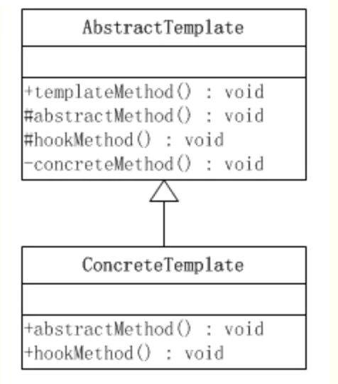

模版方法模式属于类行为型模式。

<!-- more -->

《设计模式：可复用面向对象软件的基础》中的介绍：

    “定义一个操作中算法的骨架，而将一些步骤延迟到子类中”
    “能使得子类能在不改变一个算法的结构的情况下，即可重定义该算法的某些特定步骤”


# 结构图


以上，可见模版方法模式包括：

`AbstractTemplate`
* 抽象的模版方法
* 定义了一个或多个抽象操作，以便让子类实现。这些抽象操作叫做基本操作，它们是一个顶级逻辑的组成步骤。

`ConcreteTemplate`
* 具体的模版方法
* 实现父类所定义的一个或多个抽象方法，它们是一个顶级逻辑的组成步骤。

每一个抽象模板角色都可以有任意多个具体模板角色与之对应，而每一个具体模板角色都可以给出这些抽象方法（也就是顶级逻辑的组成步骤）的不同实现，从而使得顶级逻辑的实现各不相同。

看起来的感觉就是抽象类，以及其具体实现子类。


# 示例代码

```java
// 抽象类，模板方法被设置为 final 
public abstract class Game {

    abstract void initialize();
    abstract void startPlay();
    abstract void endPlay();

    // 模板
    public final void play() {
        // 初始化游戏
        initialize();
        // 开始游戏
        startPlay();
        // 结束游戏
        endPlay();
    }
}
```

```java
// 创建扩展了上述类的实体类
public class Football extends Game {

    @Override
    void endPlay() {
        System.out.println("Football game finished!");
    }

    @Override
    void initialize() {
        System.out.println("Football game initialized! Start the game.");
    }

    @Override
    void startPlay() {
        System.out.println("Football game started. Enjoy the game!");
    }
}
```


# 优缺点
优点
1. 封装不变部分，扩展可变部分。
2. 提取公共代码，便于维护。
3. 行为由父类控制，子类实现。

缺点
* 每一个不同的实现都需要一个子类来实现，导致类的个数增加，使得系统更加庞大。