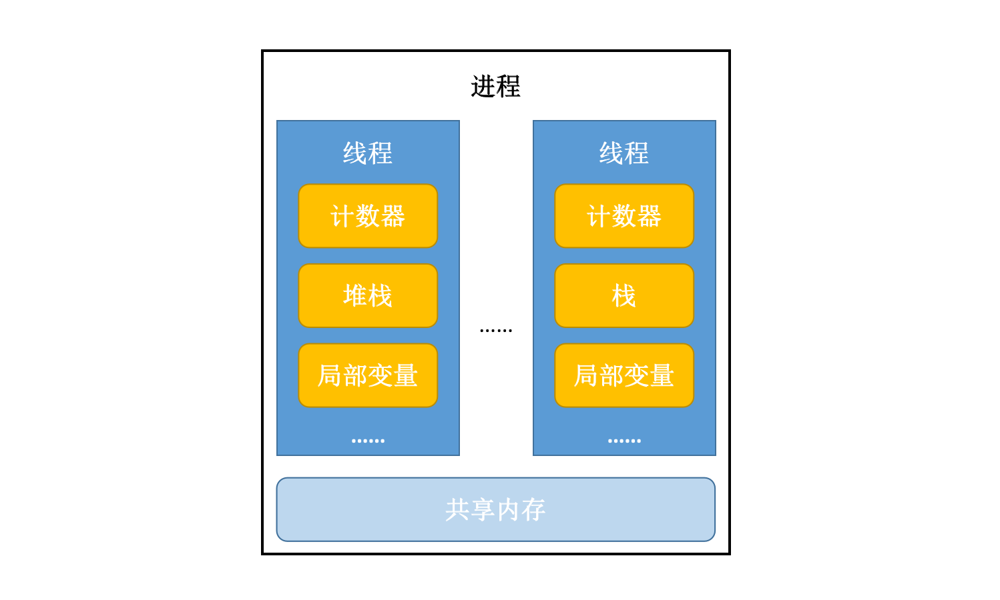

今天在学习整理系统并发的知识点的时候，发现自己对操作系统调度的某些概念有些模糊了，特别是线程这一块。今天就另开一个帖子记一下。

<!-- more -->

# 概念

首先来区分两个概念：**进程**与**线程**

进程，是操作系统的资源调度实体
* 内存中运行的一个应用程序，就会对应地启动一个（或多个）进程
    * 如：Windows 系统中，一个运行的 .exe 为一个进程
* 每个进程都有自己独立的一块内存地址空间和运行环境
* 一个进程可以包含一个或多个线程，但至少要包含一个线程

进程被启动之后，操作系统会为进程分配资源，最主要的是内存空间
* 进程中有些程序流程块是乱序的，且可同时被多次执行
* 代码块——线程体

而线程，是对程序中单独顺序控制流程的封装，即一个执行流程
* 进程**调度的最小单元**
* 线程本身依靠程序的进行而运行（总是属于某个进程），只能使用分配给它所依靠的进程的资源和环境
* 主要由线程ID、当前指令指针（PC）、寄存器集合（Registers）和堆栈（Heap & Stack）等组成
* 一个进程可运行多个线程，多个线程共享进程的内存
    * 包括内存空间和打开的文件
* 线程也叫“**轻量级进程**（**Light-Weight Process**, **LWP**）”

处理器在线程之间高速地切换，让使用者感觉线程在同时执行。

刚刚说到，一个进程可以包含不止一个线程。  
单线程，指的是程序中只存在一个线程；实际上，程序的主方法就是一个主线程。  
多线程，指的是在一个程序中运行多个任务，目的是更好的使用CPU资源。一个程序中多个线程如果同时执行的时候，我们称之为**并发**。



<br/>

# 线程状态

**就绪**
* 线程被分配了除 CPU 以外的全部资源，等待获得 CPU 调度

**运行**（Running）
* 就绪状态的线程获得了 CPU，开始执行程序代码
* 一个正在运行的线程仍然处于可运行状态
* 线程一旦运行了，就不必始终保持运行；有的时候，运行中的线程被中断，以便让其他的线程获得运行机会
* 如线程数目多于处理器数目，调度器会采用时间片机制

**阻塞**
* 线程因发生 I/O 或其他操作导致无法继续执行
* 此时线程会放弃处理机（CPU 使用权），转入线程就绪队列

**挂起**
* 由于终端请求，或操作系统的要求等原因，导致挂起

那进程状态是怎样定义的？由于进程不是调度单位，不必划分成过细的状态，如 Windows 操作系统中仅把进程分成可运行和不可运行态，挂起状态属于不可运行态。

<br/>

# 线程同步

当使用多个线程来访问同一个数据时，非常容易出现线程安全问题。  
比如，多个线程都在操作同一数据（竞争条件 race condition），导致数据不一致。

此时需要使用同步机制解决：只能让一个线程将所有操作都执行完，且在它执行过程中，其他线程不参与执行。

线程同步前提：
* 必须有两个或两个以上线程运行
* 必须多个线程使用同一个锁
* 优点：解决多线程安全问题
* 缺点：多个线程需要判定锁，耗费资源

线程同步不是高枕无忧的，处理不当的话，很容易导致**死锁**问题：
* 两个线程互相等待竞争资源，导致两边都无法得到资源，使自己无法执行
* 或：两个线程均无法达到执行所需条件

举个死锁的例子：

```java
public class DeadLockDemo {
    private static String A = "A";
    private static String B = "B";

    public static void main(String[] args) {
        new DeadLockDemo().deadLock();
    }

    private void deadLock() {
        Thread t1 = new Thread(new Runnable() {

            @Override
            public void run() {
                synchronized (A) {
                    try {
                        Thread.currentThread().sleep(2000);
                    } catch (InterruptedException e) {
                        e.printStackTrace();
                    }
                    synchronized (B) {
                        System.out.println("t1");
                    }
                }
            }
        });
        Thread t2 = new Thread(new Runnable() {

            @Override
            public void run() {
                synchronized (B) {
                    synchronized (A) {
                        System.out.println("t2");
                    }
                }
            }
        });
        t1.start();
        t2.start();
    }
}
```

t1 获得锁 A 之后，在尝试获得锁 B 的时候，t2 获得了锁 B，并在尝试获得锁 A；两者互相尝试去获得对方已经获得的锁，自然就会发生死锁。

如何避免死锁？
* 避免一个线程同时获得多个锁
* 避免一个线程在锁内同时占用多个资源
* 尝试使用定时锁
* 加锁和解锁必须在一个数据库连接里


另外，引入**生产者与消费者模型**可以解决问题：
1. 生产者仅在仓储未满时生产，仓满则停止生产；
2. 消费者仅在仓储有产品时才能消费，仓空则等待；
3. 当消费者发现仓储无产品可消费，则通知生产者生产；
4. 生产者生产出可消费产品时，应通知等待的消费者消费

<br/>

# 多线程编程的**优势**

* 进程间不能共享内存，但线程之间共享内存很容易
* 系统创建线程所分配的资源相对创建进程而言，代价小

<br/>

# 多线程就一定快吗？

<big>**不一定。**</big>

起更多的线程，并不能保证程序最大程度上并发执行；若想要通过多线程让程序执行得更快，则需要面临很多的问题和挑战。  
最大的问题，便是**上下文切换**和线程**创建/销毁**的开销。


## 上下文切换

支持多线程执行程序的单核 CPU 通过给每个线程分配 CPU 时间片（一般是几十 ms），并且通过时间片分配算法，在不同的时间片之间高速切换，以执行不同线程的任务。

因为切换速度飞快且频繁，才让人感觉多个线程好像在同时执行。  
而且在切换至下一个时间片之前，需要保存上一个时间片执行任务的状态，以便到时候切换回上一个时间片的正确状态，重新加载并执行。  
以上都是上下文切换消耗资源，影响执行效率的原因。

如何**减少上下文切换**？

从程序设计的角度来看，可以尽量不在程序中使用锁，即采用无锁编程（无锁并发）：比如先将数据的 ID 通过 hash 算法取模，不同的线程根据模的值来处理不同的数据。

实在是需要锁的话，最好使用 CAS 算法来实现乐观锁的机制。

另外，可以通过协程来实现在单线程里实现多任务的调度，维护多任务的切换。


## 线程的创建和销毁

使用线程池来减少创建销毁线程带来的系统开销。

</br>

# 线程管理的资源限制

并发代码运行的环境通常会受到硬件资源和软件资源的限制。
* 硬件资源限制包括网络带宽、硬盘读写速度、CPU 处理速度等；
* 软件资源限制包括数据库连接数、socket 连接数等。

将某个程序的串行程序改造成并行之后，如果由于资源限制使得程序仍然是在串行执行，这样便会使得 CPU 在串行执行程序的时候**依然需要切换时间片**和**调度资源**，程序比改造前还慢。

集群可以克服硬件资源限制；资源池可以克服软件资源限制。

运行环境实在是受限制的话，程序应该根据限制的情况调整并发度。  
一般来说，最佳线程数 = CPU 核心数 * [1 + (I/O 耗时 / CPU 耗时)]。
