传输层负责在会话进程之间建立和维护端到端的连接，实现网络环境中分布式进程通信。

<!-- more -->

# 传输层与传输层协议

计算机网络的本质，就是要**实现分布在不同地理位置的主机之间的进程（应用程序）通信，并以此为基础，实现应用层的各种网络服务功能**。

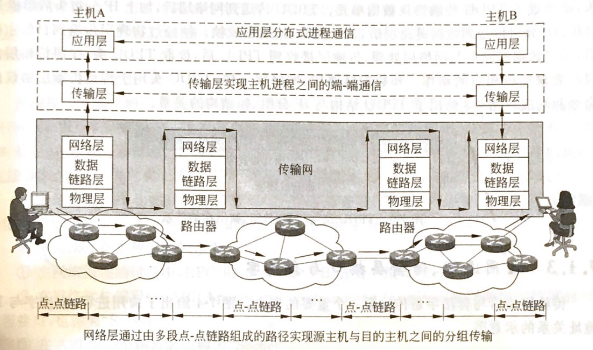

而 OSI（或者是 TCP/IP）协议模型中的**传输层**实现了**分布式**进程通信，是实现各种网络应用的基础：

* 传输层利用网络层所提供的服务（IP 分组数据传输 + “点 - 点”链路传输路径），在源主机的应用进程与目的主机的应用进程之间建立“端 - 端”连接，实现分布式进程通信；
* 同时传输层会对 IP 分组丢失、线路故障进行检测；并采取相应的差错控制措施，满足分布式进程通信对服务质量（QoS）的要求；
* 另外，传输层能够屏蔽传输网实现技术的差异性，弥补网络层提供服务的不足。

## 传输实体

传输层中实现传输层协议的实体如下：

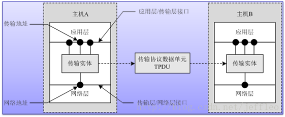

图中的**传输协议数据单元**（Transport Protocol Data Unit, **TPDU**），就是传输层之间（不同传输实体）所传输的报文：

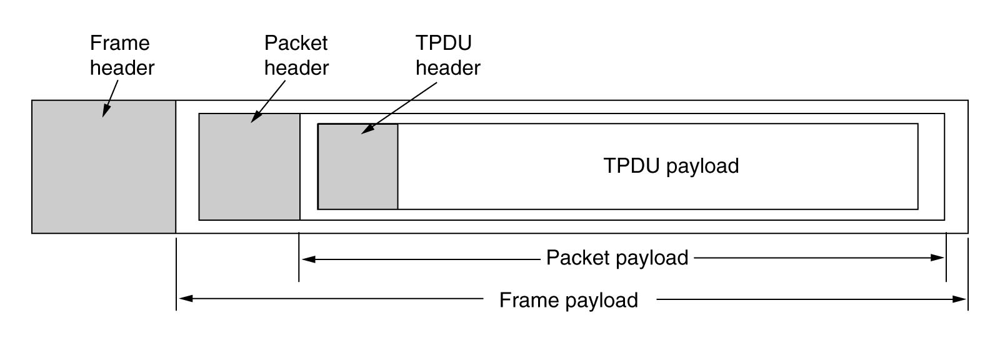

如上：

* TPDU 的有效载荷（**payload**）是来自于应用层的数据；
* 传输层在 TPDU payload 前加上 TPDU 头，便组成了 TPDU；
* TPDU 在往下传递过程中，加上 IP 分组头组成 IP 分组，加上帧头、帧尾组成帧，等

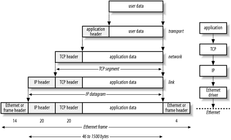

传输层的协议一般有两个，也是最常用的两个：**UDP** 和 **TCP**。

 

# UDP

UDP 全称 User Diagram Protocol，数据报协议。在 1980 年协议面世的时候，标准文件只有 3 页，这也说明它设计的主要原则，就是**协议简洁，运行快捷**。

UDP 协议只提供端口形式的传输层寻址与一种可选的校验和功能，主要特点主打一个**尽力而为**。

首先，UDP 是面向报文（Segment）的传输层协议：

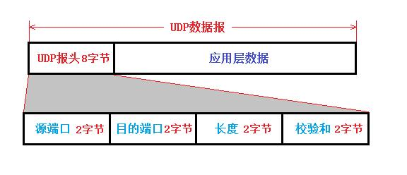

对于应用层提交过来的报文，UDP 协议会添加 UDP 报头构成 TPDU，再向下提交至 IP 层。

要注意的是，UDP 协议对应用层提交过来的报文**既不合并，也不拆分**：而是保留原报文的长度和格式，接收端将发送端提交传送的报文**原封不动**地提交至接收端应用程序。

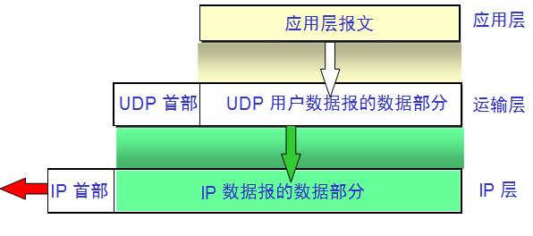

⚠️ 注：使用 UDP 协议时应选择合适长度的报文，报文太短会导致协议开销相对较大；太长，则 UDP 协议向 IP 层提交的 TPDU 可能在 IP 层被分片，降低协议效率。

其次，UDP 是无连接，不可靠的传输层协议：

1. 通信双方不需要提前建立好连接，这减少了协议开销与传输延迟；
2. 作为补偿机制，UDP 为报文提供了可选的**校验总和**，用以检验数据完整性，而且为数据包的传输提供端口号

UDP 熟知的端口号如下：

| 端口号 | 服务进程 | 说明 |
| ----- | ------- | --- |
| 53    | DNS     | 域名服务 |
| 67/68 | DHCP    | 动态主机配置协议 |
| 69    | TFTP    | 简单文件传输协议 |
| 161/162 | SNMP  | 简单网络管理协议 |
| 520   | RIP     | 路由信息协议 |

UDP 服务与端口号映射表会**定期**在 RFC768 等文件中公布，并可在大多数 UNIX 主机的 `/etc/services` 文件中得到。

注：与 DNS 不同的是，DHCP、SNMP 的客户端和服务器端在通信时都要使用熟知端口号。

不过除了可选的校验和，UDP 几乎没有其他任何可以保证数据传输可靠性的措施；也就是说，不一定能提供可靠的数据传输，也并不能保证数据准确无误地到达目的地。

如收到的分组校验出错，则**丢弃该分组**，既不确认，也不通知发送端和要求重传。

## UDP 头结构

UDP 的头长度固定为 8 个字节。结构如下：

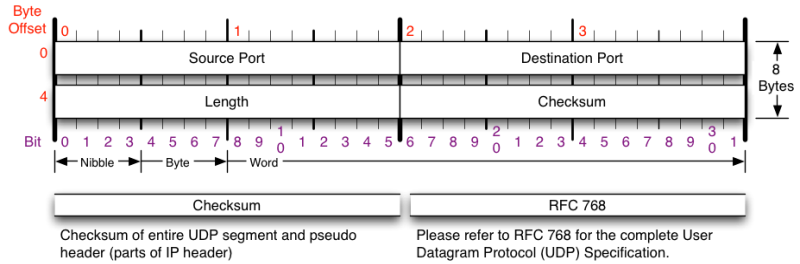

**源端口号**（**Source Port**，16 位）：表示发送端进程端口号

**目的端口号**（**Destination Port**，16 位）：表示接收端进程端口号

如源进程为客户端，则源端口号为 UDP 软件分配的临时端口号，目的端口号为服务器的熟知端口号。

**长度**（**Length**，16 位）：定义了包括报头在内的用户数据报总长度
* 最大为 65535 字节，最短为 8 字节（即 UDP 头自身长度）
* 实际数据长度最大为 65535 - 8 = 65527 字节

**校验和**（**Checksum**，16 位）用于检验整个用户数据报、UDP 报头与伪报头在传输中是否出现差错（效率优先），可选；如应用程序对通信效率要求高于可靠性，应用程序可选择不使用校验和。

校验和包括伪报头（pseudo header）、UDP 报头与数据。

伪报头包括以下内容：
* IP 分组头的源 IP 地址（16 位）
* 目的 IP 地址（16 位）
* 协议字段（8 位）：17，表示 UDP 报文（取 IP 分组头的一部分，其中填充域字段要补 0）
* UDP 长度（16 位）

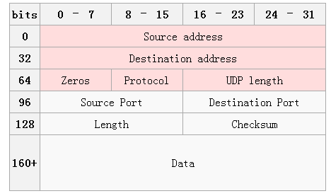

UDP 的长度不包括伪报头的长度；伪报头并不是 UDP 的真实头部，只是在计算时临时加上去起作用的，它既不向低层传输，也不向高层传送。

如果没有伪报头，那校验的对象只是 UDP 报文，也能判断 UDP 报文传输是否出错；但是如果 IP 分组头出错，那么分组就有可能会传送到错误的主机。因此在 UDP 校验和中习惯增加伪报头。

## 适用的应用场景

1. 对数据交付实时性要求高，对数据交付可靠性要求相对较低
    * 对时间敏感的应用适用 UDP 协议：相比于等待响应，数据包丢失在某程度上是可以接受的；
    * 适用于简单的响应协议，如 DNS 和 NTP
2. 视频播放应用
    * 用户关注的是视频流能尽快和不间断播放，丢失个别数据报文对视频节目的播放效果不会产生严重影响
    * 采用 TCP 会因为重传个别丢失的报文而加大传输延迟，反而不利
3. 简短的交互式应用
    * 只需要进行简单的请求与应答报文的交互
    * 可设置“定时器/重传机制”去处理由于 IP 数据分组丢失的问题，不需要确认/重传机制，提高工作效率
4. 多播和广播应用
    * UDP 支持一对一、一对多和多对多的交互式通信，TCP 不支持
    * UDP 没有拥塞控制，在网络拥塞时不要求源主机降低报文发送速率，而只会丢弃个别的报文

# TCP

TCP 全称 Transmission Control Protocol，传输控制协议。相比于 UDP，TCP 的特点如下：

## 特点

**1**. TCP 是支持面向连接（Connection）的传输服务。

应用程序在使用 TCP 协议传送数据时，必须在源进程端口与目的进程端口之间建立一条 TCP **传输连接**，每个连接用双方**端口号**标识，为双方的**一次**进程通信提供服务。

**2**. TCP 支持字节流（Stream）传输

流相当于管道：从一端放入什么，就可从另一端取出什么，以此来描述不丢失、不重复和不乱序的数据传输过程。

TCP 将应用程序提交的数据看成一连串、无结构的字节流；为支持字节流传输，发送端 & 接收端都需要使用缓存，发送端使用缓存是因为要存储从应用程序送来的数据。

TCP 不可能为发送的每个写操作创建一个报文段，而是会选择将几个写操作组合成一个报文段，再提交至 IP 层。随后：

* IP 协议将数据封装成 IP 分组之后传送到接收端，接收端的 TCP 协议再将接收到的字节存储在接收缓存中；
* 应用程序随后使用读操作将接收数据从接收缓存中读出；
* 接收端应用程序数据字节的起始与终结位置需由应用程序自行确定

**3**. TCP 支持全双工通信，允许通信双方在任意时候发送数据。

**4**. TCP 支持同时建立多个并发的 TCP 连接

有的时候根据应用程序需要，比如一个 Web 服务器必须要同时处理多个客户端的访问，那么 TCP 协议应该支持一个服务器与多个客户端同时建立多个 TCP 连接，也支持一个客户端与多个服务器同时建立多个 TCP 连接。

**5**. TCP 支持**可靠**的传输服务

因为 TCP 建立在不可靠的网络层 IP 协议之上，因此想要保证可靠的传输服务，TCP 需要自行解决：

* 使用**确认机制**对发送和接收的数据进行跟踪、确认和重传，检查数据是否安全和完整地到达；
* 提供**拥塞控制**功能，该功能是 TCP 的核心；
* 在相互进行通信的设备和服务之间保持一个虚拟连接；
* TCP 为发送的每一个数据包提供一个序号，以此保证在接收**无序、丢失**或在数据传输期间**被破坏**的时候能完成数据恢复；
* 一旦 IP 或以下协议层出现传输错误，需要能不断进行重传

这一点是 TCP 协议存在的目的。

![]

## TCP 头结构

TCP 头的长度为 20 - 60 字节（固定长度 20 字节，TCP 选项字段最长 40 字节）：

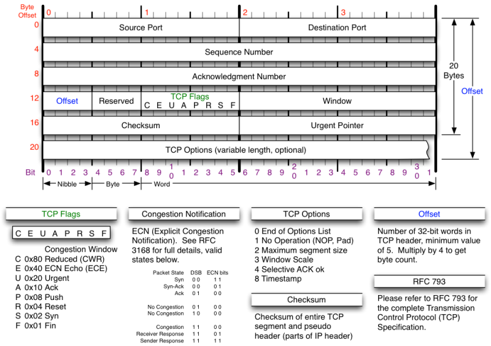

**源端口号**（**Source Port**，16 位，2 字节）：表示发送某个报文段的应用进程的源端口号

**目的端口号**（**Destination Port**，16 位，2 字节）：表示接收某个报文段的接收进程的目的端口号

**序号**（**Sequence Number**, seq，32 位，4 字节）：TCP 给将要发送的字节流（Stream）中每个字节按照顺序编号，以此解决包乱序的问题
* 范围从 0 至 4,284,967,295（$2^{32} - 1$）
* 在 TCP 建立连接时，通信双方需要使用随机数产生器产生一个初始序号（Initial Sequence Number, **ISN**）；
* 并且，双方各自随机产生初始序号：因此在一个 TCP 连接中，通信双方序号可以不同

**确认号**（**Acknowledgment Number**, ack，32 位，4 字节）
* 表示一个进程已经正确接收到序号为 N 的字节，要求发送端接下来应该发送序号为 N+1 的字节
* 如主机 B 接收到主机 A 序号为 500 的字节，则 B 发送至 A 的确认号应该为 501
* 确认号发送时会捎带上确认方法

**报头长度**（**Offset**，4 位）：TCP 报头长度以 4 字节为一个单位计算，即该字段的值为 5（5 * 4 = 20, `0101`） 至 15（15 * 4 = 60, `1111`）之间

**保留字段**（**Reserved**，6 位）

**控制字段**（TCP Flags）

用于 TCP 的连接建立和终止、流量控制，以及数据传输过程，使用时在同一时间可设置一位或多位。包括如下标记位：

1. **紧急**（**Urgent**, URG, **U**）位
    * URG = 1：该报文优先级高，需插到报文段最前面，尽快发送
    * 需要与紧急指针字段（Urgent Pointer）一起使用

2. **确认**（**Acknowledge**, **ACK**, A）位：TCP 规定，在 TCP 建立连接之后发送的所有报文段的 ACK 位都要置 1

3. **推送**（Push, **PSH**）位：应用于交互式通信
    * 如果一端应用程序希望输入一个指令后能够立即得到响应，则应置 PSH 为 1
    * 设置后会立即创建一个报文段发送给对方
    * 对方接收到 PSH 为 1 的报文段后，会尽快提交至应用进程，请求尽快应答

4. **复位**（Reset, **RST**）位
    * RST = 1时：因主机崩溃等原因造成 TCP 连接出错，需立即释放连接，然后重新连接
    * TCP 拒绝一个非法 TCP 报文或拒绝释放一个连接

5. **同步**（**SYN**）位
    * 在连接建立的时候用来同步序号
    * SYN = 1 & ACK = 0：标记一个连接建立请求报文
    * SYN = 1 & ACK = 1：标记同意建立连接的响应报文

6. **终止**（Final, **FIN**）
    * 用来释放一个 TCP 连接
    * FIN = 1：表示发送端的报文段发送完毕，请求释放 TCP 连接

**窗口**（**Window**，16 位）：0 至 65535 ($2^{16}-1$) 之间

* 因为接收端的接收缓冲区存在限制，所以在接收下一个 TCP 报文段之前，接收端会通知发送端，这次最多可发送多少字节的报文段
* 发送端根据这个接收端的处理能力来发送数据，而不会导致接收端处理不过来
* 同时，发送端会根据接收端通知的窗口值去动态调整自己的发送窗口值大小

**校验和**（**Checksum**）
* 必填字段，且同样需要伪报头
* 协议字段值为 6

**紧急指针**（**Urgent Pointer**，16 位）
* 只有当紧急标志 URG = 1 时才有效；此时报文段中包括紧急数据
* TCP 协议软件要在优先处理完紧急数据之后才能恢复正常工作

**选项字段**（**Options**），包括：
* 单字节选项
    * 0: 选项结束（Ends of Options List）
    * 1: 无操作（No Operation, NOP, Pad）
* 多字节选项
    * 2: 最大报文段长度（Maximum Segment Size, MSS）：规定 TCP 报文数据的最大值，不包括报头长度
    * 3: 窗口扩大因子（Window Scale）
    * 8: 时间戳（Timestamp）

注：MSS 的值与每次传输的窗口大小无关
* 窗口字段值指的是接收端通知发送端下一次可以连续传输的字节数
* MSS 规定的是一个 TCP segment 最多能放的数据的字节数

MSS 值的选择应考虑下列因素：

1. 协议开销
    * 例：报头和 MSS 值均为 40 字节时 -> 报文段 50% 用来传输数据
    * MSS 值太小会增加协议开销
2. IP 分片
    * MSS 值选得太大：受到 IP 分组长度的限制，较长报文段在 IP 层会被分片传输 -> 增加网络层开销和传输出错概率
3. 发送和接收缓冲区的限制：直接影响到发送和接收缓冲区设置的大小和使用效率

MSS 的默认值：536 字节
* 对于某些应用未必适用：在建立 TCP 连接时使用 SYN 报文中最大段长度选项来协商
* TCP 允许双方选择使用不同的 MSS 值

## TCP 连接建立和释放：三次握手与四次挥手

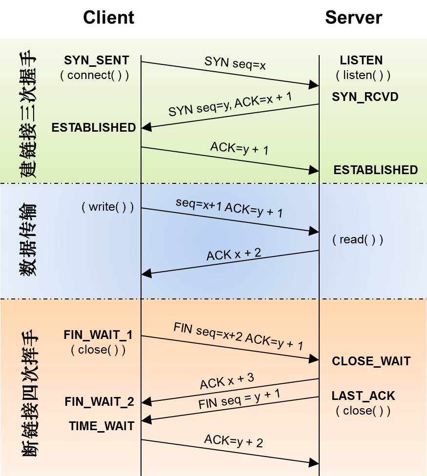

连接建立的过程俗称“**三次握手**”：

1. 在开始连接之前，客户端的 TCP 进程处于 `CLOSED`（关闭）状态；
2. 开始连接：客户端调用 `connect()` 准备发起 TCP 连接，进入 `SYN_SENT`（准备发送）状态；
    * 服务端 TCP 进程需为 `LISTEN`（收听）状态；
    * 客户端发送 **SYN = 1** 的**连接建立请求报文**到服务端；
    * 连接建立请求报文不携带数据字段，这次传输的报文序号 `seq = x`；
    * x 值随机产生，但不能为 0：避免因 TCP 连接非正常断开而可能引起的混乱
3. 如果连接突然中断：可能有一两个进程同时等待双方确认应答
    1. 此时有一个新连接的序号也从 0 开始；
    2. 则接收进程有可能认为是对方重传的报文：可能造成连接错误
4. 服务端收到连接建立请求报文后：
    1. 如果同意建立连接，则向客户端返回**连接建立请求确认报文**；
    2. 报文的标识位 SYN = 1, ACK = 1；
    3. 不携带数据字段，序号 `seq = y`；
    4. 报文的确认号 `ack = x + 1`，意为对上一个连接建立请求报文序号 `seq = x` 的确认
5. 服务器端从 LISTEN 进入 `SYN_RCVD`（准备接收）状态
6. 客户端收到服务端的连接建立请求确认报文，再向服务端发送又一个**连接建立请求确认报文**：
    1. 报文标识位 ACK = 1；
    2. 不携带数据字段，序号 `seq = x + 1`，意为承接客户端发送到同一服务端的上一报文的序号，即之前的连接建立请求报文；且响应上一个连接建立请求报文的确认号 `ack = x + 1`；
    3. 报文确认号 `ack = y + 1`，为对前一个连接建立请求确认报文序号 `seq = y` 的确认
7. 客户端发出该确认报文后进入 `ESTABLISHED`（连接建立）状态
8. 服务器端接收到该报文之后也进入 `ESTABLISHED` 状态

总的来说，全过程相当于试探一下对方是否遵循 TCP/IP 协议，协商完成之后就可以进行通信了。

**报文传输**

TCP 传输连接建立后，客户端便可与服务端进行全双工字节流传输。

为保证 TCP 工作正常、有序进行，TCP 会为某一次会话设置保持计时器（keep timer），防止 TCP 连接处于长时间空闲状态。

* 如果服务端接收到了客户端的报文，服务端则将保持计时器复位；
* 如果服务端超过了计时器设定的时间没有收到客户端信息，则发送探测报文；
* 如发送了 10 个探测报文（每个相隔 75 秒）还没有响应，服务端会认为客户端故障，从而终止连接。

连接释放的过程俗称“**四次挥手**”，客户端和服务端都可以主动提出连接释放请求。

以客户端提出释放 TCP 连接的“四次挥手”为例：

1. 客户端调用 `close()` 执行“主动关闭”（active close），随后进入 `FIN-WAIT-1`（释放等待 - 1）状态：
    1. 客户端会向服务端发送**连接释放请求报文**，并停止发送数据；
    2. 报文的标识位 FIN = 1, ACK = 1；
    3. 报文不携带数据字段,序号 `seq = u`（客户端发送的最后一个字节序号 + 1）
3. 服务端接收到连接释放请求报文后，执行“被动关闭”（passive close），进入 `CLOSE-WAIT`（等待关闭）状态：
    1. 服务端向客户端响应**连接释放请求确认报文**，为对接收到第一个连接释放请求报文的确认；
    2. 报文序号 `seq = v`，为服务端发送的最后一个字节序号 + 1；
    3. 确认号 `ack = u + 1`
    4. ⚠️ 此时客户端到服务端的 TCP 连接已经断开，但服务端到客户端的 TCP 连接依然保持连接，服务器可继续发送未发送的数据报文；此时为“**半关闭**（half-close）”状态
4. 客户端收到服务端的连接释放请求确认报文后，进入 `FIN-WAIT-2`（释放等待 - 2）状态
5. 服务端将所有要发送的报文发送完毕后，向客户端发送**连接释放请求报文**
    1. 服务端进入 `LAST-ACK`（最终确认）状态，通知 TCP 可以释放连接；
    2. 报文的标识位 FIN = 1, ACK = 1；
    3. 报文序号假定为 seq = w（取决于从半关闭到最终确认状态之间，服务端是否发送过报文；如没有则 `seq = v`）；
    4. 确认号 `ack = u + 1`
6. 此时客户端早无数据传输，因此服务端的确认号不变
7. 服务端转回 `LISTEN` 或 `CLOSED` 状态
8. 客户端收到服务端的连接释放请求报文后，向服务器端返回**连接释放请求确认报文**
    1. 报文的标识位 ACK = 1；
    2. seq = u + 1, ack = w + 1；
    3. 随后：客户端进入 TIME-WAIT 状态

客户端进入 TIME-WAIT 状态的背景是：TCP 关闭一个连接时，并不认为该连接马上得到真正的关闭。

为了保证 TCP 连接释放过程能正常运行，协议还设置了时间等待计时器（TIME-WAIT timer）：

* 此时再等待两个最长报文寿命（Maximum Segment Lifetime, MSL）后，客户端才进入 CLOSED 状态；
* 这种设计是为了确保服务端在最后阶段发送给客户端的数据，以及客户端发送给服务端的最后一个请求确认报文都能被正确接收，防止因个别报文传输错误导致连接释放失败。

综上，TCP 每个阶段的状态图如下：

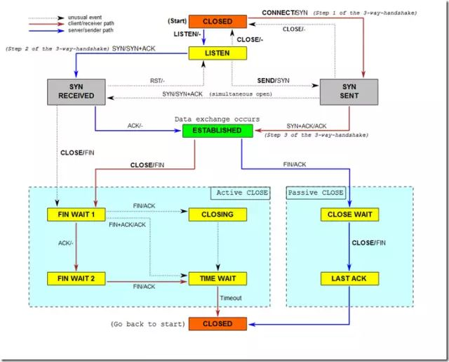

## TCP 协议滑动窗口与确认重传机制

TCP 协议的设计思想，是让应用进程传输给协议的数据作为一个字节流而存在，而不是从协议本身去限制应用层数据的长度。

也就是说，在数据交换的过程中，应用进程无需考虑发送数据的长度；数据交由 TCP 协议负责将字节分段打包，发送端利用已建立的 TCP 连接，将字节流传送到接收端的应用进程。

然而，传输层往下一层的网络层里面，IP 分组在传输过程中不可避免会出错；因此需要 TCP 协议提供差错控制、确认和重传功能，保证接收的字节流正确。

TCP 采用以字节为单位的**滑动窗口协议**（Sliding-Windows Protocol）来跟踪和记录字节流的发送、接收、确认与重传，实现差错控制：

* 发送端对缓存设置发送窗口：窗口不为 0 即可发送报文段
* 接收端设置接收窗口：窗口值等于接收缓存可以继续接收的字节流大小
* 接收端窗口大小由接收端决定
* 根据接收缓存剩余空间大小
* 根据应用进程读取数据的速度
* TCP 不可能对每一个字节进行确认
* 将字节流分成段，一个段多个字节打包成一个 TCP 报文段来传送
* TCP 通过报头序号标识发送的字节，通过确认号表示已被正确接收的字节

### 传输字节流状态分类

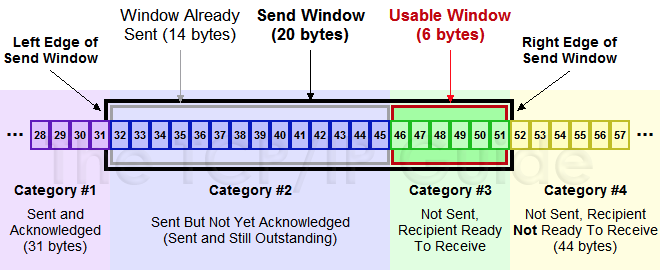

以上为滑动窗口的示意图，图中对传输字节流的状态分成了四个阶段：

* 第一类：已发送，且已得到确认的字节（图中 `#31` 字节及之前的数据）；
* 第二类：已发送，但并未得到确认的字节（`#32` - `#45` 字节）；
* 第三类：未发送，但接收端表示准备接收的字节（#46 - #51 字节）
* 接收缓冲区已准备好接收该字节
第四类：未发送，且接收端未准备接收的字节（#51 字节之后）

2. 发送窗口与可用窗口
* 发送窗口：决定发送端在每一次发送过程中能连续发送的字节数
* 等于第二类与第三类字节数之和
* 如上图的发送窗口大小为 14 + 6 = 20
* 可用窗口：表示可随时发送的字节数
* 等于第三类字节数
* 如上图的可用窗口大小为 6
* 可用窗口字节发送完毕之后
* 第三类字节变成第二类字节（即 #32 - 51 为第二类）
* 处理确认 & 滑动发送窗口
* 如：接收端发送 ACK 确认 #32 - 36 的字节，并保持发送窗口大小不变（20）
* 窗口开始滑动，第一类字节序号为 #37 之前
* 第二类字节为 #37 - 51，第三类字节为 #52 - 57，第四类字节为 #57 之后

特点：
* TCP 使用发送和接收缓冲区，以及滑动窗口机制来控制 TCP 连接上的字节流传输
* TCP 滑动窗口面向字节流，起到差错控制的作用
* 接收端可在任何时候发送确认，窗口大小可由接收端来根据需要增大或减小
* 发送窗口值可小于接收窗口值，不能超过接收窗口值；发送端可根据自身需要决定

选择重传策略
* 出现接收字节流序号不连续的情况

处理方法：
1. 拉回方式
* 在丢失第 2 个报文段时：
* 不管之后的报文段接收是否正确，都要求从第 2 个报文段开始，重传所有后面的报文段
* 效率低
2. 选择重传方式（Selective ACK, SACK）
* 如所有字节的序号都在接收窗口内，则首先完成接收窗口内字节接收，然后将丢失的字节序号通知发送端
* 发送端只需要重传丢失的报文段，不需要重传已经接收的报文段

重传计时器（Retransmission Timer）：控制报文确认与等待重传的时间
发送端 TCP 发送报文：
* 将它的一个报文的副本放入重传队列，同时启动一个重传计时器
* 重传计时器设定一个值：如 400 ms，然后开始倒计时
* 计时到 0 之前收到确认：报文传输成功
* 到 0 时仍未收到确认：传输失败，准备重传

影响超时重传时间的因素：
* 数值过低：已被接收端正确接收的报文被重传，造成报文重复
* 数值过高：报文已经丢失但发送端等待时间过长，降低通信效率

1. 如一个主机同时与其他两个主机建立两条 TCP 连接
* 需要分别为每个 TCP 连接启动一个重传计时器
* 如：其中一个 TCP 连接用于在本地局域网中传输文本文件；另一个则通过 Internet 访问远端 Web 服务器视频文件
* 两个 TCP 连接的报文发送和确认信息返回的往返时间（Rout-Trip Time, RTT）相差很大
* 须分别设定不同的重传时间
2. 在不同的时间段，Internet 用户数量变化很大，流量与传输延迟变化也很大
* 即便是相同的两个主机在不同时间建立的 TCP 连接，且完成同样的 Web 访问操作，客户端与服务器端之间的报文传输延迟也不会相同
3. 传输层本就建立在“尽力而为”的 IP 协议之上：
* 报文往返时间在数值上离散较大很自然

超时重传时间的选择：只能采用动态的自适应的方法
* 根据对端-端报文往返时间的连续测量，来不断调整重传定时器的超时重传时间

1. 当前最佳返回时间 RTT 值的估算
* 一个 TCP 连接维护一个当前最佳往返时间 RTT 估算值
* 发送一个报文段便启动一个重传计时器
* 测量该报文段从发送到被确认的往返时间
* 如果出现超时，启动重传
* 某次测量的往返时间为 M，则更新的当前最佳返回时间 RTT 估算值为 ${RTT = α × RTT + M}
* α 为常数加权因子（0 ≦ α ＜ 1），决定 RTT 对延迟变化的反应速度
* 当 α 接近 0 时，短暂的延迟变化对 RTT 影响不大；
* 当 α 接近 1 时，RTT 将紧紧跟随往返时间变化，影响很大
* RFC2988 建议 α 的参考值为 0.125
* 例：最初往返时间 RTTS 估算值为 30 ms
* 已知收到 3 个确认报文段，测量的往返时间 M 分别为 26ms，32ms，24ms
* RTTS0 = 30ms
* RTTS1 = 0.125 × 30 + 26 = 29.75ms
* RTTS2 = 0.125 × 29.75 + 32 ≈ 35.72ms
* RTTS3 = 0.125 × 35.72 + 24 ≈ 28.47ms
* 以上为每次更新的 RTTS 估算值

2. 超时重传时间（Retransmission Time-Out, RTO）
* 略大于加权计算出来的 RTTS 估计值
* 建议计算公式：RTO = RTTS + 4 × RTTD
* RTTD 为 RTT 的偏差加权平均值，和 RTTS 与测量值 M 之差相关
* 第一次测量：RTTD1 = M1 / 2
* 以后：RTTD = (1 - β) × (旧的 RTTS) + β × | RTTS - M |
* β 为常数加权因子，建议取 0.25
* 接近 1 ：TCP 能迅速检测报文丢失，及时重传，减少等待时间，但可能引起更多的重传报文
* 太大：重传报文减少，等待时间太长
* 例：β = 0.25，旧的 RTTS = 30ms，新的 RTTS = 35ms，M = 32ms
* RTTD = (1 - 0.25) × 30 + 0.25 × |35 - 32| = 23.25 ms
* RTO = 35 + 4 × 23.25 = 128ms

## TCP 协议滑动窗口与流量控制、拥塞机制

1. TCP 窗口与流量控制（flow control）
* 研究流量控制算法目的：控制发送端发送速率，使之不超过接收端的接收速率
* 防止由于接收端来不及接收送达的字节流，而出现报文段丢失的现象
* 滑动窗口协议利用报头中窗口字段实现流量控制

控制过程：
* 在此过程中，接收窗口又称为“通知窗口（Advertised Windows）”
* 接收端根据接收能力选择合适的接收窗口（rwnd, receiving window）值，将其写入 TCP 报头
* 将当前接收端的接收状态通知发送端
* 发送端的发送窗口不能超过接收窗口的数值
rwnd 数值单位为字节，而不是报文段
* 接收端应用进程从缓存中读取字节的速度 ≧ 字节到达速度：接收端需要在每个确认（ACK）中发送“非零窗口”通告（rwnd > 0）
* 发送端发送速度 > 接收端消费速度：缓冲区被全部占用，后到达字节因缓冲区溢出而丢弃
* 接收端必须发出“零窗口”通知（rwnd = 0）
* 发送端接收到“零窗口”通知后：停止发送，直至下一次接收到接收端的“非零窗口”为止

如上图，接收方确定的 rwnd = 400，假设每次发送方每次发送报文段的长度为 100 字节

坚持计时器（Persistence Timer）
如果下一个非零窗口通告丢失：发送端无休止等待接收端通知——陷入死锁
* 当发送端 TCP 接收到一个零窗口通知时：启动坚持计时器
* 当计时器时间到：发送端 TCP 发送一个零窗口探测报文
* 提示接收端：非零窗口通知丢失，需要重传
* 其值设置为重传时间的数值，最大为 60 秒
* 如发出的第一个零窗口探测报文没收到应答：继续发送，直到收到非零窗口为止

流量控制的传输效率问题
* 发送端应用进程将数据传送到 TCP 协议的发送缓存后：控制全传输任务就由 TCP 协议承担
* TCP 协议必须注意解决好“何时”发送“多长报文段”
* 问题复杂：受到应用进程产生数据的速度与接收端发送能力限制

极端情况：每次只发送一个字节
* IP 分组共 41 字节——1 + 20字节 TCP 报头 + 20 字节 IP 报头
* 接收端接收后没有数据发送，也要立即返回一个 40 字节的确认分组（20字节 TCP 报头 + 20 字节 IP 报头）
* 接收端向发送端发出窗口更新报文，通知将窗口前移 1 个字节（40 字节）
* 发送端发送一个字节的数据（41 字节）
* 则：输入一个字符需要发送 162 字节的 4 个报文段——资源浪费

采用 Nagle 算法提高效率：
* 当数据以每次 1 字节进入发送端：第一次只发送 1 字节，其它字节存入缓存区
* 第一个报文段符合时，再将缓存中的数据（不止 1 字节）放在第二个报文段中发出去
* 一边发送等待应答；一边缓存待发送数据
* 当缓存的数据字节数达到发送窗口的 1/2 或接近最大报文段长度 MSS 时：立即发送

另一种情况：糊涂窗口综合征（Silly Windows Syndrome）
* 假设 TCP 接收缓存已满，应用进程每次只从接收缓存读取 1 字节
* 接收端缓存腾空 1 字节，并向发送端发出确认报文，且将接收窗口设为 1
* 发送端发送的确认报文长度为 40 字节
* 随后发送端发送一个字节的数据（41 字节）
* 解决方法：禁止接收端发送只有 1 字节的窗口更新报文
* 让接收端等待一段时间至接收缓存有足够空间接收一个最大长度的报文段，或缓冲区空出一半，再发送窗口更新报文
即：发送端不要发送太小的报文段，接收端的 rwnd 不能太小

2. TCP 窗口与拥塞控制
拥塞控制：用于防止过多报文进入网络而造成的路由器与链路过载
注意：
* 流量控制：重点在点-点链路的通信量的局部控制上
* 拥塞控制：重点在进入网络报文总量的全局控制上
流量控制可以很好地解决发送端与接收端之间的端-端报文发送和处理速度的协调，但无法控制进入网络的总体流量。
随着网络流量增加，网络通信负荷过重，引起报文传输延时增大或丢弃，报文的差错确认又会加剧网络拥塞

网络出现拥塞的条件：对网络资源的需求总和 > 网络可用资源
例：某段时间用户对某类资源要求过高——造成拥塞
* 链路带宽 100 M，连接在该链路上的 100 台计算机要求以 10 M 的速度发送数据
* 解决：升级链路带宽至 1 G
* 某节点缓存容量过小 / 处理速度太慢，造成进入节点的大量报文不能及时被处理，不得不丢弃报文
* 解决：升级主机，更换大容量缓存、高速处理器
——以上均不能根本上解决网络拥塞问题

拥塞处理(congestion handling)

负载（load）：单位时间进入网络的字节数
吞吐量（throughput）：单位时间内通过网络输出的字节数

1. 未采取拥塞控制方法时：
* 开始阶段：吞吐量随网络负载增加呈线性增长
* 轻度拥塞：吞吐量增长小于负载增加量
* 网络负载继续增加而吞吐量不变：饱和状态
* 饱和状态后吞吐量随网络负载增加而减少
* 增加到一定程度：吞吐量为 0 ，系统出现死锁（deadlock）

2. 理想拥塞控制：
* 网络负载达到饱和点之前，网络吞吐量一直保持线性增长的关系
* 到达饱和点后：网络吞吐量维持不变
3. 实际拥塞控制：
* 网络负载增长初期：由于要在拥塞控制过程消耗一定资源——吞吐量小于无拥塞控制状态
* 在负载增加过程中：限制进入网络的报文或丢弃部分报文，是吞吐量逐渐增长，不出现下降和死锁现象

拥塞控制前提：网络能承受现有的网络负荷
实现拥塞控制最基本手段：TCP 协议滑动窗口
* 拥塞窗口（Congestion Window）：发送端根据网络拥塞情况确定的窗口值
* 发送端真正确定发送窗口时，应取“通知窗口”与“拥塞窗口”中的较小值
* 接收端需要根据自己的接收能力给出一个合适的接收窗口 rwnd
* 从流量控制角度：发送窗口一定不能超过接收窗口
* 发送窗口上限值 = Min(rwnd, cwnd)
* rwnd > cwnd：拥塞窗口限制发送窗口的最大值
* rwnd < cwnd：接收端接收能力限制发送窗口的最大值
* 没有发生拥塞：接收端的通知窗口和拥塞窗口一致

使用到的参数：
* 拥塞窗口（cwnd）:拥塞控制的关键参数，它描述源端在拥塞控制情况下一次最多能发送的数据包的数量
* 通告窗口（awin）:接收端给源端预设的发送窗口大小，它只在 TCP 连接建立的初始阶段发挥作用
* 发送窗口（win）:源端每次实际发送数据的窗口大小
* 慢启动阈值（ssthresh）:拥塞控制中慢启动阶段和拥塞避免阶段的分界点。初始值通常设为 65535byte
* 回路响应时间（RTT）:一个 TCP 数据包从源端发送到接收端，源端收到接收端确认的时间间隔
* 超时重传计数器（RTO）:描述数据包从发送到失效的时间间隔，是判断数据包丢失与否及网络是否拥塞的重要参数。通常设为2RTT或5RTT
* 快速重传阈值(tcprexmtthresh):：能触发快速重传的源端收到重复确认包 ACK 的个数。当此个数超过 tcprexmtthresh 时，网络就进入快速重传阶段。tcprexmtthresh 缺省值为3。

拥塞控制算法通过动态调节用户对网络资源的需求来保证网络系统的稳定运行
* 1999 年 RFC 2581 对 TCP 协议规定了四种拥塞控制方法
1. 慢启动
2. 拥塞避免
3. 快重传
4. 快恢复
* 发送端确定拥塞窗口大小时可采用 慢启动 和 拥塞避免 算法

3. 算法
TCP 连接中，发送端还需要维持一个拥塞窗口（cwnd, congestion window）的状态参数
* 拥塞窗口的大小根据网络的拥塞情况动态调整
* 网络无拥塞：发送端逐步增大拥塞窗口
* 出现拥塞：拥塞窗口立即减小
* 网络是否出现拥塞：取决于路由器是否丢弃分组
* 基于的假设：线路质量好，丢弃分组原因不是因为物理层传输出错，而是因为网络中分组传输总量大，超过了路由器的接收能力，造成路由器过载

慢启动（Slow-Start）
* 场景：主机开始发送数据
* 对网络负载状态不了解——试探着从小到大逐步增加拥塞窗口
* 预定义：一个往返——第一个 从发送端发送报文（MSS）到接收端，接收端在规定时间内返回了确认报文 的动作
* 此时：主机在建立一个 TCP 连接的初始化时，将慢启动的初始值设为 1
* 第一个往返首先将拥塞窗口（cwnd）设为 2，然后向接收端发送两个最大报文段
* 如：接收端在定时器允许的往返时间内返回确认——网络不拥塞，拥塞窗口按二进制指数增长
* 即：第二个往返 cwnd = 4
* 如报文正确传输：第三个往返 cwnd = 8
* 如再正确：第四个往返 cwnd = 16，如此类推
* 若在规定时间没有收到确认报文：表明网络开始出现拥塞

注意：
1. 每一次发送的往返时间 RTT 是不同的：取决于连续发送报文段的多少
* 每个过程的往返时间应从连续发送多个报文段，到接收到所有发送报文段确认消息需要的时间
* 如第一个往返过程中 cwnd = 2：该次可连续发送两个报文段
* 发送端必须都收到这两个报文段的确认，才能判断网络没有出现拥塞
2. “慢启动”的“慢”：不是指 cwnd 从 1 开始，然后按照二进制指数增长的速度
* 而是指：试探着将 cwnd 逐步增大，比突然将很多报文发送到网络的情况要“慢”
* 意味着发送报文段的多少存在着逐步加快的过程
3. 定义“慢启动阀值（slow-start threshold, ssthresh）”：避免 cwnd 增长过快引起网络拥塞
* cwnd < ssthresh：使用慢启动算法
* cwnd > ssthresh：使用拥塞控制算法
* cwnd = ssthresh：两种算法均可使用
* 如 cwnd = 32 时出现超时：发送端可将 ssthresh 设置为：ssthresh = cwnd / 2 = 16

拥塞避免（Congestion Avoidance）
* （每增加一个往返就将 cwnd 加倍）改成每增加一个往返就将 cwnd 加一
* cwnd 呈线性增加，缓慢增长
* 只要发现接收端没有按时返回确认：网络拥塞，将 ssthresh 值设为 cwnd / 2，并重新进入下一轮慢启动，即此时 cwnd = 1

慢启动 + 拥塞避免
* 连接初始化时 cwnd = 1，慢启动初始阀值 ssthresh = 16（单位为 MSS）
* 4 个往返后 cwnd 增长至 16，TCP 传输进入拥塞避免控制阶段
* 假设：cwnd = 24 时发送端检测出现超时—— cwnd 被重新设成 1，ssthresh 被设成 24 / 2 = 12
* 1 - 4 往返的 cwnd 分别为 2, 4, 8, 16，5 - 12 往返的 cwnd 分别为 17 - 24
* 之后重新开始慢启动 + 拥塞避免
* 13 - 17 往返的 cwnd 分别为 1, 2, 4, 8, 12，18 之后的往返就分别加一

注：
* 只要出现超时就将 ssthresh 减半——“乘法减小（Multiplicative Decrease）”算法
* 开始执行拥塞避免，缓慢加一——“加法增大（Additive Increase）”算法
* 合称 AIMD（Additive Increase Multiplicative Decrease）算法——加性增窗，乘性减窗
缺点：举例说明
* 当发送端连续发送报文 M1 - M7，只有 M3 在传输过程中丢失，M4 - M7 都能正确接收
* 此时不能根据一个 M3 的超时而简单判断网络出现拥塞
* 替代方法：快重传 和 快恢复

快重传（Fast Retransmit）
例：
* 如接收端在正确接收 M1、M2 报文并返回确认，没有接收到 M3 报文，而是接收到 M4：
    * 接收端不能对 M4 进行确认（M4 为乱序报文）
* 根据“快重传”算法规定：
* 接收端应及时向发送端连续三次发出对 M2 的“重复确认”，要求发送端尽早重传未被确认的报文

快恢复（Fast Recovery）：与快恢复算法配合
规定：
1. 接收端收到第一个对 M2 的“重复确认”时：发送端立即将拥塞窗口 cwnd 设置为最大拥塞窗口值的 1/2 
    1. 执行“拥塞避免”算法，cwnd 按照线性方式增长
2. 接收端收到第二个对 M2 的“重复确认”时：发送端立即减小 cwnd
    1. 执行“拥塞避免”算法，cwnd 按照线性方式增长
3. 接收端收到第三个对 M2 的“重复确认”时：发送端立即减小 cwnd
    1. 执行“拥塞避免”算法，cwnd 按照线性方式增长

# 通信单元 Socket

应用进程、传输层接口与套接字（socket）

* Handler in the communication chain. 
* 应用程序（进程）与传输层的 TCP 或 UDP 都是在主机操作系统控制下工作
* 在一台计算机中，不同进程需要使用进程号（process ID）被唯一地标识
* 进程号也被称为端口号（port number）
* 可用于计算机之间通信，也可用于同一计算机进程之间的通信
* 在计算机网络中，只有知道 IP 地址与端口号，才能唯一地找到准备通信的进程
* RFC793 定义的 套接字（socket）由 IP 地址与对应的端口号组成
    * IP 地址: 端口号
    * 如 10.116.53.141:7070
* 网络中两个应用程序通过一个双向的通信连接实现数据交换

Socket 的不同含义：
1. 网络原理：RFC793 规定 socket = IP 地址: 端口号
2. 网络软件编程：Socket 指网络程序的 API
    * Socket 是 TCP/IP 协议十分流行的 PI
    * Socket 所支持的协议种类不光 TCP/IP 一种
3. 详见 Socket（套接字）
* API 中的一个函数名也可称为 Socket
* 操作系统中也有关于 Socket 的讨论

# 进程标识方法：端口号

TCP/IP 传输层的寻址通过 TCP 与 UDP 的端口号实现
* 应用层程序分别选择 TCP 或 UDP 作为传输层协议
* 为了区分不同网络程序：TCP 和 UDP 规定用不同端口号表示不同的应用程序

端口号分配方法
* 数值范围：0 ~ 65535
* 类型（端口号范围从小到大）：
* 熟知端口号、注册端口号、临时端口号

临时端口号：49152 ~ 65535
* 由 TCP/UDP 软件随机选取，只对一次进程通信有效

注册端口号：1024 ~ 49151
* 用户开发一种新的网络应用程序时，为防止应用在 Internet 使用出现冲突而在 IANA 登记的端口号

熟知端口号（Well-Known Port Number，公认端口号）：0 ~ 1023（系统端口）
* TCP / UDP 为每种标准的 Internet 服务器进程分配一个确定的全局端口号
* 每个客户进程都知道响应的服务器进程的熟知端口号
* 由 IANA 统一分配。查询：http://www.iana.org/

TCP 的熟知端口号

| 端口号 | 服务进程 | 说明 |
| ----- | ------- | --- |
| 20    | FTP     | 文件传输协议（数据连接） |
| 21    | FTP     | 文件传输协议（控制连接） |
| 23    | TELNET  | 网络虚拟终端协议 |
| 25    | SMTP    | 简单邮件传输协议 |
| 80    | HTTP    | 超文本传输协议 |
| 179   | BGP     | 边界路由协议 |

进程标识方法示意图：

# 多重协议的识别

* 网络中进行通信（使用同一种应用程序）的两台主机，必须在通信前确定都采用 TCP，还是都采用 UDP
* 如考虑到进程标识和多重协议的识别，网络环境中一个进程的全网唯一标识应该使用三元组
* 在 UNIX 中称为“半相关”（half-association）：
    * 协议（TCP）
    * 本地地址（10.116.50.5）
    * 本地端口号（8080）
* 完整的进程通信标识（一个完整的 Socket）——使用五元组（“相关”）表示：
    * 协议（TCP）
    * 本地地址（202.1.2.5）
    * 本地端口号（30022）
    * 远程地址（121.5.21.2）
    * 远程端口号（22）

传输层多路复用（multiplexing）与多路分解（demultiplexing）
* 一台运行 TCP/IP 协议的主机可能同时运行不同的应用程序
* TCP/IP 协议允许多个不同的应用程序的数据同时使用 IP 地址和一个物理连接来发送和接收数据
    * 发送端：IP 协议将 TCP 或 UDP 的传输协议数据单元 TPDU 都封装成一个 IP 分组发送出去
    * 接收端：IP 协议将从 IP 分组拆开的 TPDU 传送到传输层，由传输层根据不同 TPDU 端口号区分不同 TPDU 属性，分别传送至对应的应用程序

TCP、UDP 与应用层关系：
应用层协议中：
* 一种依赖 TCP（主要是需要大量传输交互式报文的协议）
* 一种依赖 UDP（如 P2P 会话类应用）
* 一些两种都依赖（如 DNS）

